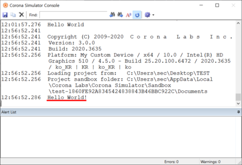
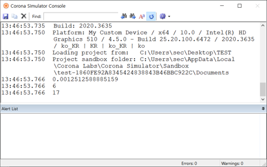

# 📗 Lua 기본문법
참고 문서: [Introduction to Lua](https://docs.coronalabs.com/guide/start/introLua/index.html)

Lua 기본문법은 원래 알던 언어와의 차이점을 중심으로 가볍게 살펴보세요.  
  
굳이 지금 모든 것을 암기할 필요는 없습니다!  
헷갈릴때마다 다시 여기로 돌아와 확인하면서 익숙해지면 됩니다.

<br>

#### 1. 기본
- **주석 사용법**
	+ 한줄 주석 (--)
	+ 여러줄 주석 (--[[]])
	```lua
	-- 한줄 짜리 주석입니다.

	--[[
		여러줄 짜리
		주석
		입니다.
	]]
	```
- **Python과 달리...**
	+ Lua에서 들여쓰기는 컴파일에 영향을 끼치지 않으며, 대신 ~ end로 코드블록을 묶어줍니다.
- **C, Java와 달리...**
	+ Lua에서는 코드 블록을 { } 괄호가 아니라 **then/do ~ end**로 묶어줍니다.
	+ 각 문장 끝에 세미콜론(**;**)을 붙이지 않습니다.

<br>

#### 2. 출력하기
- **Console창에 출력하는 print()**
	``` lua
		print("Hello World!")
	```
	

<br>

#### 3. 연산자
* **수학연산자**

	| 종류 | 연산자 | 예시 |
	|:---:|:---:|:---:|
	| 더하기 | + | 20 + 8 == 28 |
	| 빼기 | - | 20 - 8 == 12 |
	| 곱하기 | * | 20 * 8 == 160 | 
	| 나누기 | / | 20 / 8 == 2.5 |
	| 나머지 | % | 20 % 8 == 4 |
	| **제곱** | **^** | **2 ^ 4 == 16** |

* **관계 연산자**

	| 연산자 | 해석 |
	|:---:|---|
	| A > B | A가 B보다 크다 |
	| A < B | A가 B보다 작다 |
	| A >= B | A가 B보다 크거나 같다 | 
	| A <= B | A가 B보다 작거나 같다 |
	| A == B | A와 B의 값이 같다 |
	| **A ~= B** | **A와 B의 값이 다르다** |

* **논리 연산자**

	| 연산자 | 해석 |
	|:---:|---|
	| A **and** B| A와 B가 모두 true면 **true** |
	| A **or** B| A와 B 중 하나라도 true면 **true** |
	| **not** A | A가 false면 **true** |

* **기타 연산자**

	| 연산자 | 뜻 |
	|:---:|---|
	| **..** | **문자열을 합쳐주는 연산자** |
	| **#** | **배열의 길이를 반환하는 연산자** |

<br>

#### 4. 범위

**참고 문서**

* [Scope for Beginners](https://docs.coronalabs.com/tutorial/basics/scope/index.html)
* [Goodbye Globals!](https://docs.coronalabs.com/tutorial/basics/globals/index.html)

<br>

- Lua에서는 변수나 함수를 선언할 때 사용 범위를 지정해 줄 수 있습니다.
- 사용 범위에 따라 전역과 지역으로 나눌 수 있는데, **전역**은 모든 곳, 다른 lua 파일에서까지 사용할 수 있음을 의미하고, **지역**은 선언된 코드 블록에서 사용할 수 있음을 의미합니다. (해당 lua파일에서, 해당 함수 내에서, 해당 조건문/반복문 안에서.. 등등)
- 코드의 다형성, 효율성 등을 이유로 초보 개발자들은 전역이 꼭 필요한 경우가 아니라면 되도록 지역으로 선언해서 사용해주는 것이 좋습니다.


#### 5. 변수

* 변수를 선언할 때 앞에 **local**를 붙여주면 **지역 변수**, 붙이지 않으면 **전역 변수**로 선언이 됩니다.
* 변수가 비어있음(파이썬에서 None, C/Java에서는 null)을 Lua에서는 **nil**이라고 합니다.
* **C, Java와 달리**
	- 변수 선언을 할 때, 자료형(int, double..)을 따로 표시하지 않습니다.

	```lua
		HP = 100 		-- 전역 변수로 선언
		local MP = 100	-- 지역 변수로 선언
	```


* **랜덤함수 math.random()**
	``` lua
		local N = 10
		local M = 50

		print(math.random())		-- [0, 1] 사이의 실수 값
		print(math.random(N))		-- [1, N] 사이의 정수 값
		print(math.random(N, M))	-- [N, M] 사이의 정수 값
	```

	


<br>

#### 6. 함수
* 함수도 변수처럼 local을 써주면 지역 함수, 써주지 않으면 전역 함수로 사용할 수 있습니다.
* 매개변수의 자료형은 써주지 않습니다.
<br>

* 함수의 기본 틀
	```lua
		local function function_name(...)
			-- body
		end
	```
* 함수 사용 예시
	```lua
		local function add (N, M)
			return N + M
		end

		local num1 = math.random(10)
		local num2 = math.random(10)
		local sum = add(num1, num2)

		print(num1.."+"..num2.." = "..sum)
	```
* Lua에서 함수는 여러 개의 리턴 값을 가질 수도 있습니다. 쉼표로 구분지어 반환해주고, 쉼포로 구분지어 값을 받을 수 있습니다.

	```lua
		local function calculate (N, M)
			return N+M, N-M, N*M, N/M
		end

		local num1 = math.random(10)
		local num2 = math.random(10)

		local result = {}
		result[1], result[2], result[3], result[4] = calculate(num1, num2)

		print(num1.."+"..num2.." = "..result[1])
		print(num1.."-"..num2.." = "..result[2])
		print(num1.."*"..num2.." = "..result[3])
		print(num1.."/"..num2.." = "..result[4])
	```

<br>

#### 7. 조건문
* then ~ end로 코드를 묶어줍니다.
* **Python과 달리...**
	- elif 대신 elseif를 사용합니다.
* **C, Java와 달리...**
	- 조건식을 괄호로 묶어주지 않아도 됩니다.
	- else if를 쓸 때, 띄어쓰기 없이 적어줍니다.

	``` lua
		if 조건식 then
			-- 실행할 코드
		end
	```

	``` lua
		if 조건식A then
			-- A가 true일때 실행
		elseif 조건식B then
			-- A가 false, B가 true일 때 실행
		else
			-- A, B 모두 false일때 실행
		end
	```

<br>

#### 8. 반복문
* do ~ end로 코드를 묶어줍니다.

**while 문**
```lua
	while 조건식 do
		-- 실행할 코드들
	end
```

**for문**
* i가 N부터 A씩 더해서 M이 될 때까지 반복한다는 구조입니다.
* A가 1일 경우에는 생략 가능합니다.
```lua
	for i = N, M, A do
		-- 실행할 코드들
	end
```
* 예시) 10번 반복하는 for문
```lua
	for i = 1, 10 do
		-- 실행할 코드들
	end