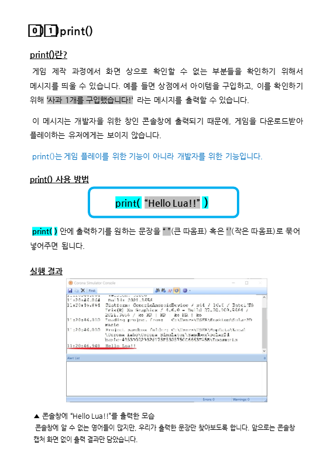
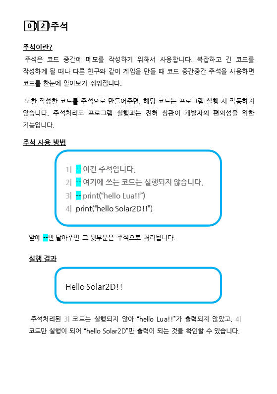
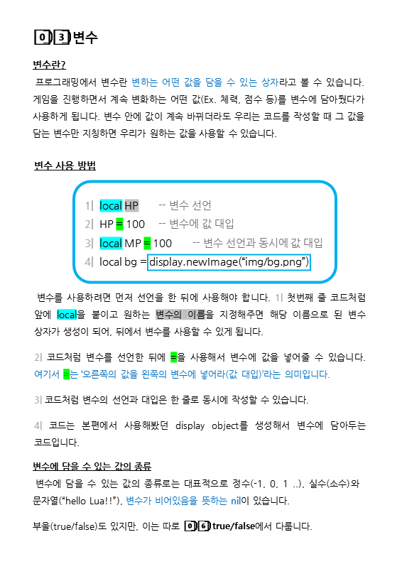
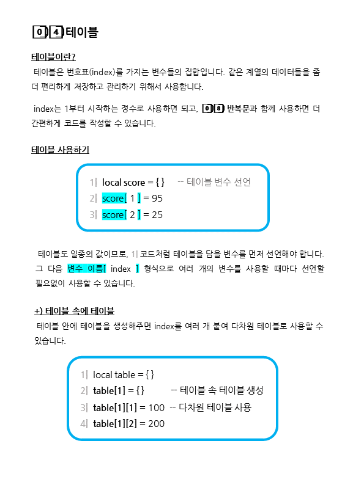
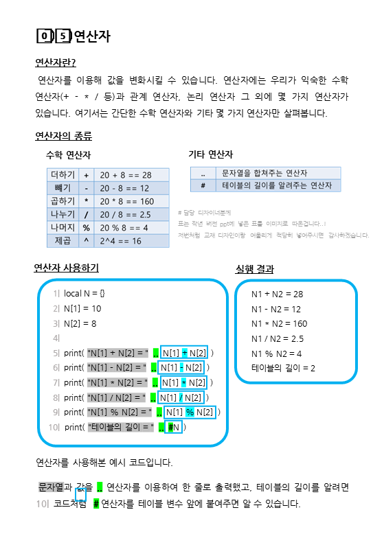

# Lua를 다루는 법

### 🏛 목차
* [print()](#0%EF%B8%8F⃣1%EF%B8%8F⃣-print)
* [주석](#0%EF%B8%8F⃣2%EF%B8%8F⃣-주석)
* [변수](#0%EF%B8%8F⃣3%EF%B8%8F⃣-변수)
* [연산자](#0%EF%B8%8F⃣4%EF%B8%8F⃣-테이블)
* [테이블](#0%EF%B8%8F⃣5%EF%B8%8F⃣-연산자)
* true/false
* 조건문
* 반복문
* 함수
* 변수의 범위

 

#### 서문

[오늘부터 게임개발(이름 수정 예정)] 시리즈에서는 Lua라는 프로그래밍 언어를 사용해서 게임을 개발합니다. 이 부록에서는 그 Lua를 다루는 방법을 다루게 됩니다.

여러분이 다른 공부를 할 때처럼 모든 것을 암기할 필요는 없습니다. 간단하게 살펴본 다음에, 나중에 필요할 때 다시 찾아서 살펴보는 과정을 여러 번 겪으면 자연스럽게 여러분에게 상식으로 자리잡게 될 것입니다.

 

### 🔗 [스터디 준비하기](lua_basic02.md#-스터디-준비하기)
### 🔗 [1주차 교안 pdf로 다운받아 보기](../image/lua_basic/lua다루는법.pdf)

### 0️⃣1️⃣ print

 

### 0️⃣2️⃣ 주석

 

### 0️⃣3️⃣ 변수

 

### 0️⃣4️⃣ 테이블

 

### 0️⃣5️⃣ 연산자

 