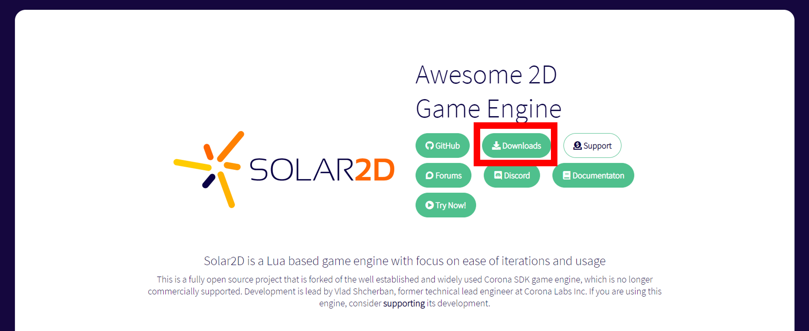
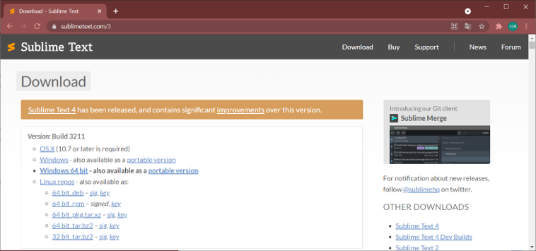
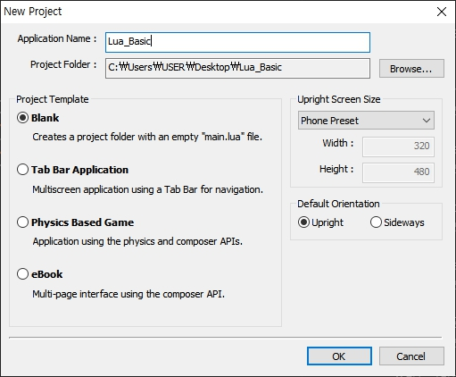
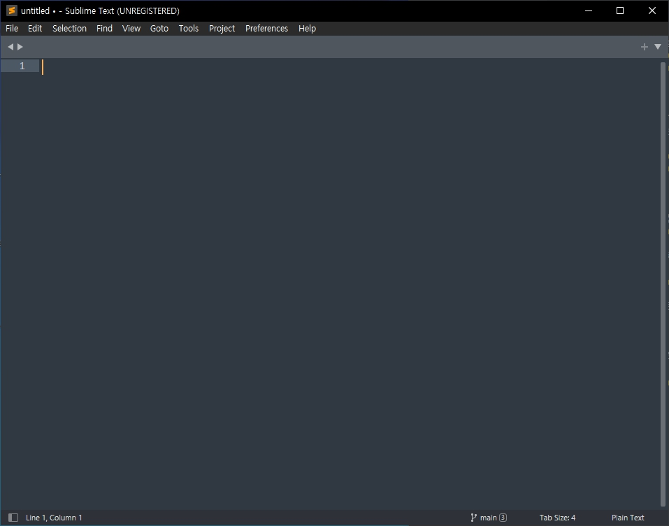
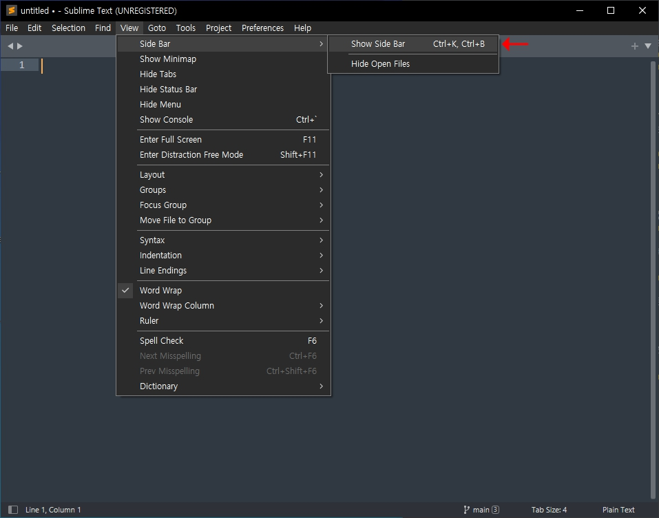
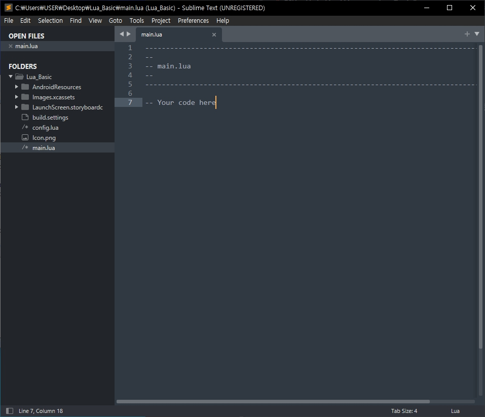
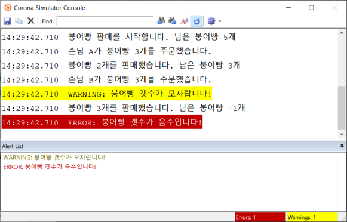
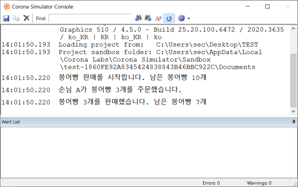

# LUA 기본문법 학습 보조 자료 & 과제
도전! 게임개발 스터디에 참여하시는 분들을 위한 학습 보조 자료

### 👩‍🔧 스터디 준비하기

#### Solar2D 설치하기 (필수)
* [설치 링크](https://solar2d.com/)  
  

<br>

#### Sublime Text3 설치 (선택)
만약 따로 쓰시는 코드 편집기가 있다면 그 것을 쓰셔도 됩니다. (ex. 비주얼 스튜디오 코드)

* [설치 링크](https://www.sublimetext.com/3)  
  

<br>

#### 프로젝트 생성

1. Solar2D 실행 후, New Project 클릭  
	  

2. 설정 후, 생성  
	※ Lua 기초 파트는 설정이 별 의미없습니다. 경로만 신경써서 생성해주시면 됩니다.
	

<br>

#### 코딩 시작하기

1. Sublime Text3 실행
	

2. View > Side Bar > Show Side Bar 클릭
	

3. 생성한 프로젝트 폴더를 Side Bar에 드래그하면 다음과 같이 폴더가 보입니다.
	Lua 기초 파트에서는 main.lua에 코드를 작성하고 실행해보면서 결과를 확인하면 됩니다.
	

	Ex.  
	```lua
	-----------------------------------------------------------------------------------------
	--
	-- main.lua
	--
	-----------------------------------------------------------------------------------------

	-- Your code here

	print("Hello Lua!!")
	```

<br>

### 1주차 과제
[제출폼](https://forms.gle/JqhBQegPadt1dXCu9)  

1. **(01. print()까지)** 다음과 같이 결과가 나오도록 코드를 작성해보세요. 
	- WARNING, ERROR 강조 표시는 무시하고 텍스트만 맞게 출력하면 됩니다.
	

2. **(04. 연산자까지)** 다음 결과가 나오도록 코드를 작성해보세요.
	- 남은 붕어빵 remain, 손님의 주문 order 변수 사용
	- 초반 붕어빵은 10개, 손님의 주문은 1-5사이의 개수
	- (+) math.random(5) = 1-5사이의 개수를 랜덤으로 생성하는 기능, 후에서 다루지만 한번 사용해보세요~! 그냥 값처럼 사용하면 됩니다.  
	```lua
	local order = math.random(5)
	```

	
	
3. **(05. 테이블까지)** 다음 코드는 잘못된 코드입니다. 잘못된 이유를 작성해주세요.
	+ 이유는 두가지입니다.  
	
	```lua
	local gugudan = {}

	local gugudan[1][1] = 1
	local gugudan[1][2] = 2
	local gugudan[1][3] = 3

	local gugudan[2][1] = 2
	local gugudan[2][2] = 4
	local gugudan[2][3] = 6
	```