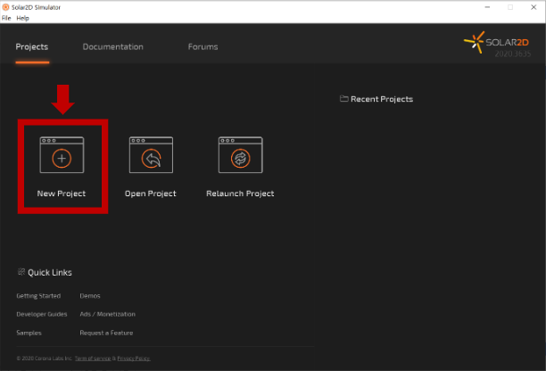

# LUA 기본문법 학습 보조 자료 & 과제
도전! 게임개발 스터디에 참여하시는 분들을 위한 학습 보조 자료

### 👩‍🔧 스터디 준비하기

#### Solar2D 설치하기 (필수)
* [설치 링크](https://solar2d.com/)  
  

<br>

#### Sublime Text3 설치 (선택)
만약 따로 쓰시는 코드 편집기가 있다면 그 것을 쓰셔도 됩니다. (ex. 비주얼 스튜디오 코드)

* [설치 링크](https://www.sublimetext.com/3)  
  

<br>

#### 프로젝트 생성

1. Solar2D 실행 후, New Project 클릭  
	  

2. 설정 후, 생성  
	※ Lua 기초 파트는 설정이 별 의미없습니다. 경로만 신경써서 생성해주시면 됩니다.
	


<br>

#### 코딩 시작하기

1. Sublime Text3 실행
	

2. View > Side Bar > Show Side Bar 클릭
	

3. 생성한 프로젝트 폴더를 Side Bar에 드래그하면 다음과 같이 폴더가 보입니다.
	Lua 기초 파트에서는 main.lua에 코드를 작성하고 실행해보면서 결과를 확인하면 됩니다.
	

	Ex.  
	```lua
	-----------------------------------------------------------------------------------------
	--
	-- main.lua
	--
	-----------------------------------------------------------------------------------------

	-- Your code here

	print("Hello Lua!!")
	```