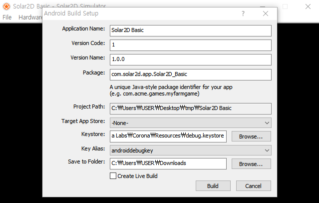
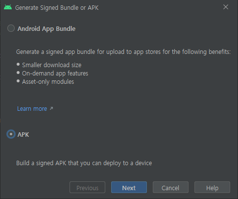
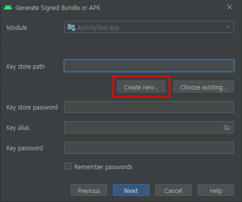
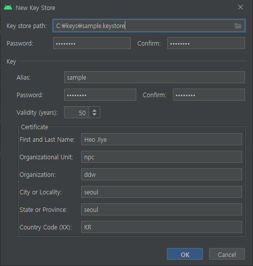
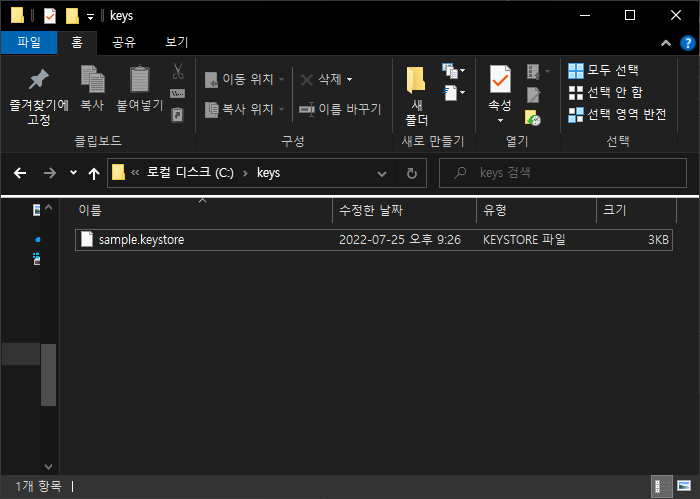
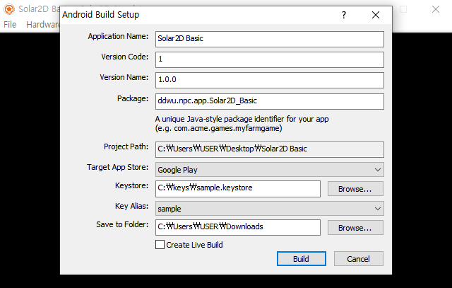

# 스토어 출시용 apk 빌드 방법

### 1️⃣ 디버그용 apk 파일 생성하기 (출시 불가)
  

### 2️⃣ 스토어 출시용 apk 빌드 방법
#### 조건
* JDK 버전 15이상
* vmware가 있울 경우, 빌드할 때 작업관리자에서 백그라운드 프로세스까지 vmware 관련 프로세스들을 강제 종료할 것
* windows10에서 모바일 핫스팟 사용 시 빌드 오류가 날 수 있음

#### 첫번째. android studio를 이용해 release keystore를 생성한다.

  

  

  

  

#### 두번째. 생성한 release keystore를 이용해 apk 빌드를 완료한다.
  