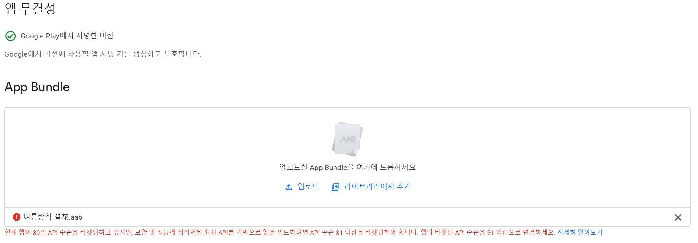

# 스토어 출시용 apk 빌드 방법

### 1️⃣ 디버그용 apk 파일 생성하기 (출시 불가)
  

### 2️⃣ 스토어 출시용 apk 빌드 방법

#### 첫번째. android studio를 이용해 release keystore를 생성한다.

  

  

  

  
적절히 입력한다.  

  
keystore 파일만 생성되었다면 OK 뒤 단계 할 필요없음

#### 두번째. 생성한 release keystore를 이용해 apk 빌드를 완료한다.
  

package는 기본 설정에서 되도록 바꾸세요!
Ex) ddwu.npc.seongbaoul

 

#### 만약 막히면 아래를 참고
* 프로그램 버전 참고 (제 환경을 적어놨습니다. 해당 버전보다 상위 버전이면 상관없을 듯 합니다.)
	- Android Studio 버전 2021.2.1
	- JDK 버전 1.8.0_301 + **JRE 설치되지 않았다면 설치할 것**
		+ JDK를 다시 다운로드한 적이 있다면 JAVA_PATH 환경 변수 수정되었는지 확인.
		+ 환경 변수 수정해도 안되면, 다른 버전의 JDK 삭제
		+ 그래도 안되면 Solar2D 삭제 후 다시 다운로드 (잔여 디렉토리까지 삭제)

* vmware가 있울 경우, 빌드할 때 작업관리자에서 vmware 관련 프로세스들을 종료해본다.
* windows10에서 모바일 핫스팟 사용 시 오류가 날 수 있음. 와이파이 이용할 것.

* 플레이 스토어 콘솔에 업로드했을때 다음과 같은 오류가 뜬다면, Solar2D 프로그램을 최신 버전으로 다시 다운로드 후, 다시 시도해주세요.
	  

 

* apk 빌드 관련은 개발팀장(스터디 담당자), 구글 개발자 콘솔 등 출시 관련은 DB팀장에게 문의