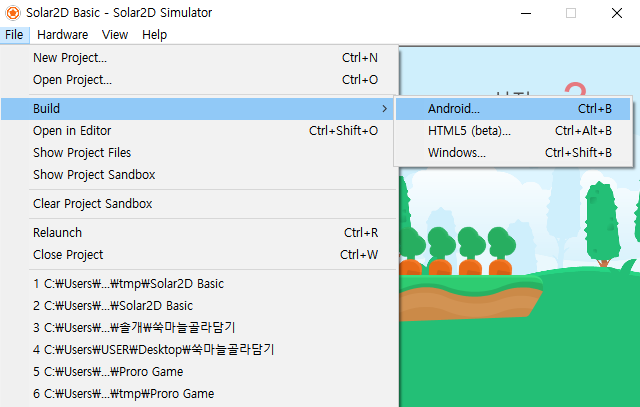

# 스토어 출시용 apk 빌드 방법

### 1️⃣ 디버그용 apk 파일 생성하기 (출시 불가)
  

### 2️⃣ 스토어 출시용 apk 빌드 방법
#### 조건
* JDK 버전 15이상

#### 첫번째. android studio를 이용해 release keystore를 생성한다.

  

  

  

  
적절히 입력한다.  

  
keystore 파일만 생성되었다면 OK 뒤 단계 할 필요없음

#### 두번째. 생성한 release keystore를 이용해 apk 빌드를 완료한다.
  

package 기본 설정에서 되도록 바꾸세요.

#### 오류가 난다면?
* vmware가 있울 경우, 빌드할 때 작업관리자에서 백그라운드 프로세스까지 vmware 관련 프로세스들을 강제 종료할 것
* windows10에서 모바일 핫스팟 사용 시 오류가 날 수 있음. 와이파이 이용할 것.

 

* apk 빌드 관련은 개발팀장, 출시 관련(구글 개발자 콘솔)은 DB팀장에게 문의할 것 