# 1️⃣  Lua 기본문법과 display 사용법

<br>

### 📗 [Lua 기본문법](./Lua_basic.md)

<br>

## 🏛 목차
* [스터디 준비하기](#-스터디-준비하기)
* [Solar2D Documentation](#-solar2d-documentation) ⬅ 동영상 강의는 여기부터!
* [실습 준비](#-실습-준비)
* [Display Object](#-display-object)
* [간단 실습 따라하기](#%EF%B8%8F%EF%B8%8F-실습-따라하기)
* [예제 게임 따라하기](#-예제-게임-따라하기)
* [이번주 과제 안내](#-이번주-과제-안내)

<br>

### 👩‍🔧 스터디 준비하기

#### [프로그램 설치](download.md)

#### 프로젝트 생성
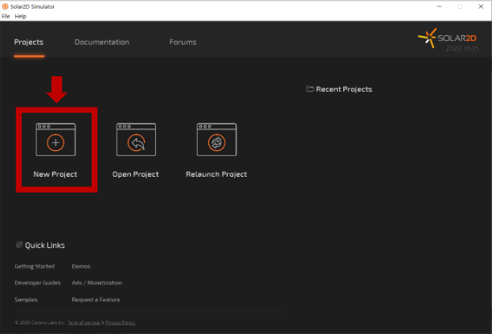  
Solar2D 실행 후, New Project 클릭

  
기본 설정 후, 생성  
해당 이미지에서는 week1로 표시했지만, 이번에 생성해서 3주차까지 사용할 프로젝트입니다!

<br>

#### 시뮬레이터 설정
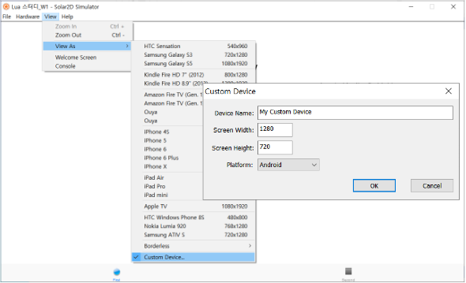

<br>

#### 📂[Image 다운로드](../image/week01/image)

맨 아래 image.zip 파일을 다운로드 후, 압축 해제해서 프로젝트 폴더에 image 폴더 안에 들어가게끔 설정해주세요.

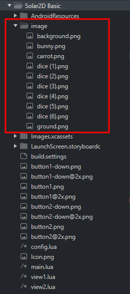<br>
다음과 같이 설정

<br>

### 🟧 [Solar2D Documentation](https://docs.coronalabs.com/)
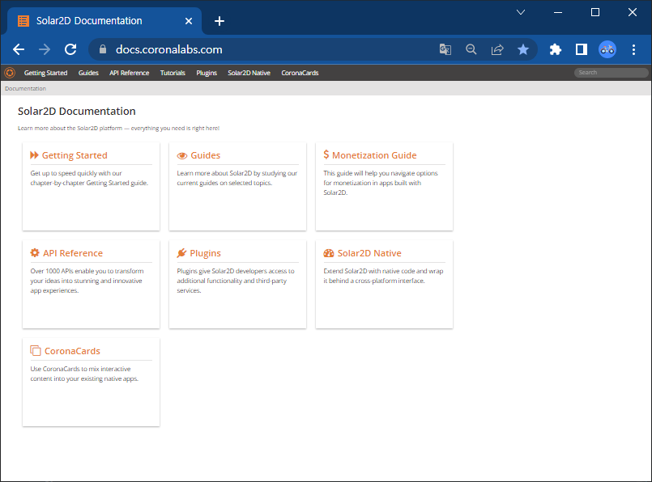 

<br>

### ⬛ 실습 준비
#### 화면 비우기
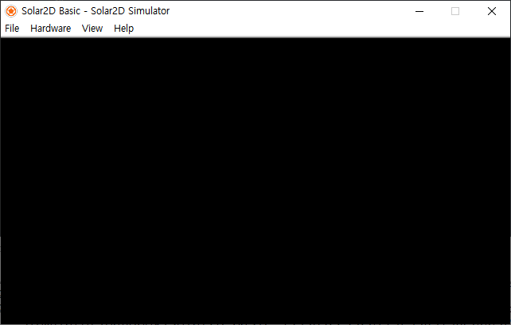  

* main.lua에서 20~37번째 줄 삭제
* view1.lua에서 13~39번째 줄 삭제
* view2.lua에서 13~40번째 줄 삭제
* 필요없는 PNG 파일도 삭제해보기  
	

### 🎨 Display Object
참고 문서: [Display Objects](https://docs.coronalabs.com/guide/media/displayObjects/index.html)

#### 자주 쓰는 display object 생성 함수

* 이미지
	- [display.newImage()](https://docs.coronalabs.com/api/library/display/newImage.html)
	- [display.newImageRect()](https://docs.coronalabs.com/api/library/display/newImageRect.html)
* 도형
	- [display.newRect()](https://docs.coronalabs.com/api/library/display/newRect.html)
	- [display.newRoundedRect()](https://docs.coronalabs.com/api/library/display/newRounedRectRect.html)
	- [display.newCircle()](https://docs.coronalabs.com/api/library/display/newCircle.html)
	- 등등..
* 텍스트
	- [display.newText()](https://docs.coronalabs.com/api/library/display/newText.html)
* **디스플레이 그룹**
	- [display.newGroup()](https://docs.coronalabs.com/api/library/display/newGroup.html)

#### 자주쓰는 display 객체 속성값
* display.contentWidth, display.contentHeight: 화면의 가로, 세로 값
* display.contentCenterX, display.contentCenterY: 화면의 가로, 세로 중심값
	- display.contentWidth/2, display.contentHeight/2 형식으로도 표현 가능

#### 기타
* [object:setFillColor](https://docs.coronalabs.com/api/type/ShapeObject/setFillColor.html)
	- object:setFillColor( **gray** )
	- object:setFillColor( **gray, alpha** )
	- object:setFillColor( **red, green, blue** )
	- object:setFillColor( **red, green, blue, alpha** )
* [object.alpha](https://docs.coronalabs.com/api/type/DisplayObject/alpha.html)
* [object:scale()](https://docs.coronalabs.com/api/type/DisplayObject/scale.html)

<br>

### 🕵️‍♀️ 간단 실습 따라하기
#### 1. 간단한 도형 출력해보기

* **display.newRect**
	```lua
		display.newRect( [parent,] x, y, width, height )
	```
	- **배경화면 출력해보기**
		+ view1.lua 13번째 줄에 다음 코드 추가
		```lua
			local background = display.newRect(display.contentCenterX, display.contentCenterY, display.contentWidth, display.contentHeight)
		```

		+ 이리저리 변형해보기
			* [object:setFillColor()](https://docs.coronalabs.com/api/type/ShapeObject/setFillColor.html)
			* [object.x](https://docs.coronalabs.com/api/type/DisplayObject/x.html), [object.y](https://docs.coronalabs.com/api/type/DisplayObject/y.html)
			* [object:scale()](https://docs.coronalabs.com/api/type/DisplayObject/scale.html)
			* 참고: [DisplayObject](https://docs.coronalabs.com/api/type/DisplayObject/index.html)
			
	- **여러개 출력해보기**
		+ 이미지 보고 따라해보기  
		
		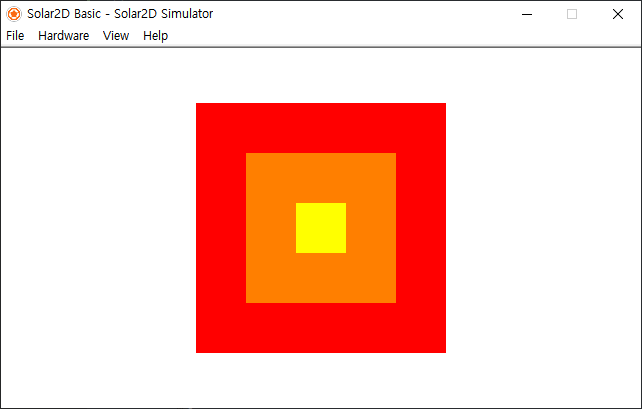

		```lua
			local object = {}
	
			object[1] = display.newRect(display.contentCenterX, display.contentCenterY, 500, 500)
			object[1]:setFillColor(1, 0, 0)
	
			object[2] = display.newRect(display.contentCenterX, display.contentCenterY, 300, 300)
			object[2]:setFillColor(1, 0.5, 0)
	
			object[3] = display.newRect(display.contentCenterX, display.contentCenterY, 100, 100)
			object[3]:setFillColor(1, 1, 0)
		```

<br>

#### 2. 디스플레이 그룹 개념 이해해보기
참고 문서: [Group Programming](https://docs.coronalabs.com/guide/graphics/group.html)

* **display.newGroup()**
	```lua
		local objectGroup = display.newGroup()
	```
	* display object를 그룹에 넣기
	
		```lua
			local objectGroup = display.newGroup()

			objectGroup:insert(object[1])
			objectGroup:insert(object[2])
			objectGroup:insert(object[3])

			sceneGroup:insert(background)
			sceneGroup:insert(objectGroup)
		```
		
		* <u>특별한 경우가 아니라면 모든 디스플레이 오브젝트들은 sceneGroup에 속하도록 해준다.</u>
		
	+ display object 정렬
		* 기본적으로 그룹에 넣은 순서대로 정렬이 됨
		* [object:toFront()](https://docs.coronalabs.com/api/type/DisplayObject/toFront.html), [object:toBack()](https://docs.coronalabs.com/api/type/DisplayObject/toBack.html)을 사용해서도 정렬 가능
		
	+ 그룹 단위로 변형해보기
		```lua
			objectGroup.x = objectGroup.x + 100
			objectGroup.y = objectGroup.y - 100
		```
		
		수정 결과  

		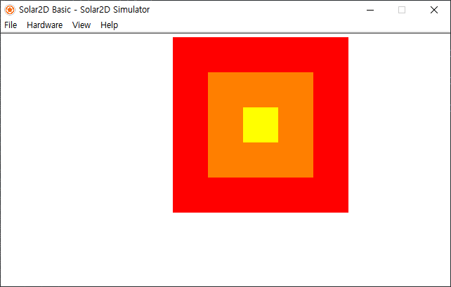


<br>

### 🎮 예제 게임 따라하기
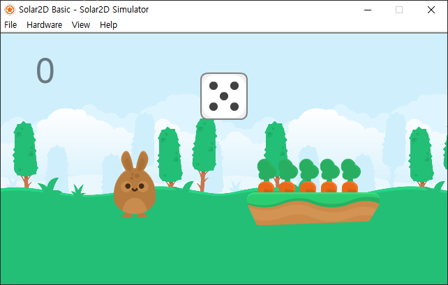   
⬆ 1주차 완성본

<br>

#### view2.lua -> game.lua 이름 변경하기

main.lua도 같이 수정

```lua
-----------------------------------------------------------------------------------------
--
-- main.lua
--
-----------------------------------------------------------------------------------------

-- include Corona's "widget" library
local widget = require "widget"
local composer = require "composer"


-- event listeners for tab buttons:
local function onFirstView( event )
	composer.gotoScene( "game" ) -- 프로젝트 실행 시에 game.lua로 이동
end

onFirstView()	-- invoke first tab button's onPress event manually
```

<br>

#### 배경 이미지 추가하기
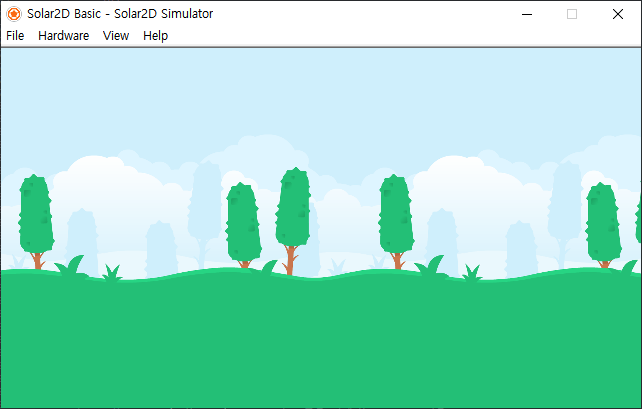

* **display.newImageRect()**
	```lua
		display.newImageRect( [parent,] filename, width, height )
	```
	- 코드 추가 (game.lua 13번째 줄 ~)
	```lua
		-- 1차시 display object ---------------------------------------------------------------------

		local background = display.newImageRect("image/background.png", display.contentWidth, display.contentHeight)
		background.x, background.y = display.contentWidth/2, display.contentHeight/2
	```


<br>

#### 토끼랑 땅 이미지 추가하기
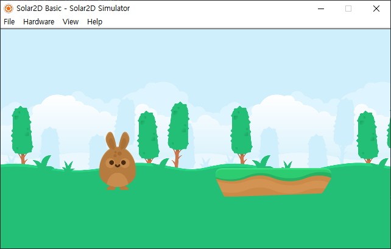

* **display.newImage**
	```lua
		display.newImage( [parent,] filename )
	```
	- **좌표 값(x, y)은 따로 설정해주어야 함**

	- 코드 추가
	```lua
		local bunny = display.newImage("image/bunny.png")
		bunny.x, bunny.y = display.contentWidth*0.3, display.contentHeight*0.6

		local ground = display.newImage("image/ground.png")
		ground.x, ground.y = display.contentWidth*0.7, display.contentHeight*0.7
	```

<br>

#### 당근 이미지 추가하기 (feat. display group)
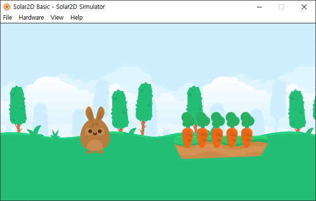  

* 코드 추가
	```lua
		local carrotGroup = display.newGroup()
		local carrot = {}

		for i = 1, 5 do
			carrot[i] = display.newImageRect(carrotGroup, "image/carrot.png", 60, 150)
			carrot[i].x, carrot[i].y = display.contentWidth*0.55 + 60*i, display.contentHeight*0.6

			--carrotGroup:insert(carrot[i])
		end
	```

<br>

#### 주사위 이미지 추가하기 (feat. 랜덤 함수)
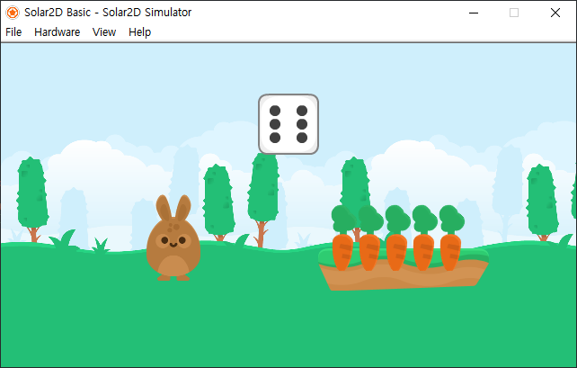 

* 코드 추가
	```lua
		local diceGroup = display.newGroup();
		local dice = {}

		for i = 1, 6 do
			dice[i] = display.newImage(diceGroup, "image/dice (" .. i .. ").png")
			dice[i].x, dice[i].y = display.contentWidth*0.5, display.contentHeight*0.25
			
			dice[i]:scale(2, 2)
			dice[i].alpha = 0
		end

		dice[math.random(6)].alpha = 1
	```

	- 새로고침(ctrl + r)을 할 때마다 주사위가 바뀜!
	- 참고: [랜덤함수](./Lua_basic.md#5-변수)

<br>

#### 점수 텍스트 추가하기
 

* **display.newText**
	```lua
		display.newText([parent,] text, [x,] [y,] [width,] [height,] [font,])
	```

	* 코드 추가
		```lua
			local score = display.newText(0, display.contentWidth*0.1, display.contentHeight*0.15)
			score.size = 100

			score:setFillColor(0)
			score.alpha = 0.5
		```

<br>

#### Quiz. 당근이미지들이 땅 이미지 뒤로 가게끔 하려면 어떻게 해야할까요??
 

* 레이어 정리 코드 추가
	```lua
		-- 레이어 정리
		sceneGroup:insert(background)
		sceneGroup:insert(bunny)
		sceneGroup:insert(ground)
		sceneGroup:insert(carrotGroup)
		sceneGroup:insert(diceGroup)
		sceneGroup:insert(score)

		ground:toFront()
	```

<br>

### 🕒 이번주 과제 안내
#### 제출 마감: 7/10(월) 자정

<br>

#### 1. Solar2D 개발자 문서 북마크하고 인증 사진 첨부하기
* 오늘 배운 것들 개발자 문서에서 한번씩 읽어보면 좋아요~ 앞으로 우리 모두 개발자 문서와 친해지기~ 🙆‍♀️🙆‍♀️

#### 2. 다음 이미지대로 실습한 후, 코드 제출하기
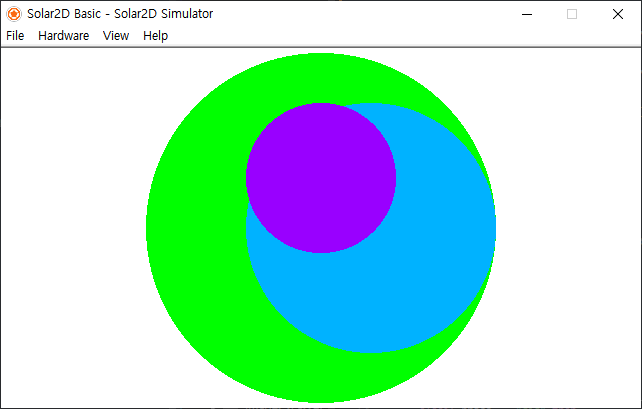  

* 본인이 작성한 부분만 복사해서 제출하면 됩니다.
* 꼭 이미지와 동일하지 않아도 display.newCircle 등 함수들을 적절히 사용만 하면 OK!
