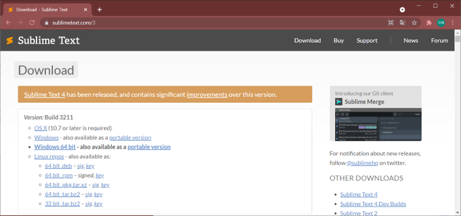

# 1️⃣  Lua 기본문법과 display 사용법

### 📗 [Lua 기본문법](./Lua_basic.md)

 

## 🏛 목차
* [스터디 준비하기](#_2)
* [Solar2D Documentation](#_2) ⬅ 동영상 강의는 여기부터!
* [실습 준비](#_2)
* [Display Object](#_2)
* [실습 따라하기](#_2)
* [이번주 과제](#_2)

 

### 👩‍🔧 스터디 준비하기

#### Solar2D 설치하기 (필수)
* [설치 링크](https://solar2d.com/)  
  

 

#### Sublime Text3 설치 (선택)
만약 따로 쓰시는 코드 편집기가 있다면 그 것을 쓰셔도 됩니다. (ex. 비주얼 스튜디오 코드)

* [설치 링크](https://www.sublimetext.com/3)  
  

 

#### 프로젝트 생성
  
Solar2D 실행 후, New Project 클릭

  
기본 설정 후, 생성  
해당 이미지에서는 week1로 표시했지만, 이번에 생성해서 3주차까지 사용할 프로젝트입니다!

 

#### 시뮬레이터 설정

 

#### 📂[Image 다운로드](../image/week01/image)

 

#### ❗ Sublime Text3 설정 Tip
