# 2️⃣  event 기초

## 🏛 목차
* [event 이해하기](#-event-이해하기)
* [간단 실습 따라하기](#%EF%B8%8F%EF%B8%8F-간단-실습-따라하기)
* [예제 게임 따라하기](#-예제-게임-따라하기)
* [이번주 과제 안내](#-이번주-과제-안내)

<br>

### 🎆 event 이해하기
* **event란?**
	- interactive application의 기초!
	- object에 **event listener 함수가 추가되어있을때, 해당 event가 발생하면 event listener 함수가 실행**이 된다!
	- ex. background에 tap 이벤트 함수를 추가되어있을때, background를 tap하면 해당 이벤트 리스너가 실행이 된다.
	```lua
		local background = display.newRect(display.contentWidth/2, display.contentHeight/2, display.contentWidth, display.contentHeight)

		local function tapEventListener( event )
			print("배경을 클릭했습니다")
		end 

		background:addEventListener("tap", tapEventListener)
	```

<br>

* **eventListener 추가하는 방법**
	1. **이벤트 리스너 함수를 작성한다.**
		- **event**라는 매개변수를 통해 일어난 event 정보가 넘어온다!
			+ Ex. event.target: 이벤트의 타겟이 누구냐, 위의 경우엔 background  
			
				```lua
				event.target.x = 100  
				event.target.alpha = 0.5  
				event.target:setFillColor(1, 0, 0)  
				```
		- 이벤트가 실행되었을때 실행될 코드를 이벤트 리스너 안에 작성해준다.
			+ 이벤트 종류에 따라 event 객체를 이용해서 복잡하게 구현해줘야 하는 경우도 있다.
			+ Ex. touch 이벤트  
			
				```lua
					local function touchEventListener( event )  
						if( event.phase == "began" ) then  
							-- 터치를 시작함  
						elseif( event.phase == "moved" ) then  
							-- 객체를 누르고 있는 상태로 움직임(드래그)  
						elseif ( event.phase == "ended" or event.phase == "cancelled") then  
							-- 터치가 끝남  
						end  
					end  
				```
	2. **오브젝트에 이벤트 리스너 함수를 추가한다.**
		- addEventListener 기본 포맷
			```lua
				object:addEventListener( event 종류, eventListener )

				background:addEventListener("tap", tapEventListener)
			```

<br>

* **event 종류**
	<br>☆: 오늘 스터디에서 다룸
	- ☆[**tap**](https://docs.coronalabs.com/guide/events/touchMultitouch/index.html#tap-detection)
	- ☆[**touch**](https://docs.coronalabs.com/guide/events/touchMultitouch/index.html#touch-detection)
	- [**key**](https://docs.coronalabs.com/api/event/key/index.html)
	- [**mouse**](https://docs.coronalabs.com/api/event/mouse/index.html)
	- ☆[<u>**timer**</u>](https://docs.coronalabs.com/api/library/timer/index.html)

<br>

### 🕵️‍♀️ 간단 실습 따라하기
#### tap 이벤트 사용해보기
* **일단 해본다**
	- view1.lua의 저번 스터디에서 진행한 다음 줄에 작성해봅니다.
		```lua
			local function tapEventListener( event )
				print("노란색 네모를 클릭했습니다!")
			end
		
			object[3]:addEventListener("tap", tapEventListener)
		```
	- 실행결과  
		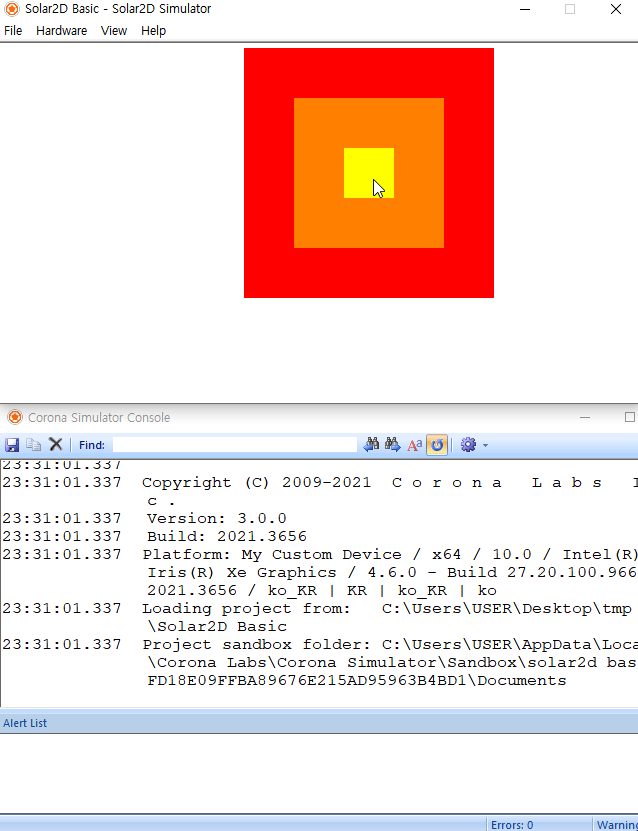

* **Quiz. 다음과 같은 경우에도 tap 이벤트가 작동할까요??**
	- 해당 오브젝트가 투명도가 0일 때
	- 다른 오브젝트 뒤에 존재할때

<br>

* 🕵️‍♀️ 정답은..
	- X
	- O

<br>

#### touch 이벤트 사용해보기
* **일단 해본다**
	- 이어서 다음 코드를 추가해보세요.
		```lua
			local function touchEventListener( event )
				if( event.phase == "began" ) then
					print("터치를 시작함")
				elseif( event.phase == "moved" ) then
					print("객체를 누르고 있는 상태로 움직임(드래그)")
				elseif ( event.phase == "ended" or event.phase == "cancelled") then
					print("터치가 끝남")
				end
			end
		
			object[3]:addEventListener("touch", touchEventListener)
		```
	
	- 실행결과  
	

* **마우스로 오브젝트 드래그하기**
	- 다음 코드를 추가
	```lua
		local function drag( event )
			if( event.phase == "began" ) then
				display.getCurrentStage():setFocus( event.target )
				event.target.isFocus = true
				-- 드래그 시작할 때

			elseif( event.phase == "moved" ) then

				if ( event.target.isFocus ) then
					-- 드래그 중일 때
					event.target.x = event.xStart + event.xDelta
					event.target.y = event.yStart + event.yDelta
				end

			elseif ( event.phase == "ended" or event.phase == "cancelled") then
				if ( event.target.isFocus ) then
					display.getCurrentStage():setFocus( nil )
					event.target.isFocus = false
					-- 드래그 끝났을 때
				else
					display.getCurrentStage():setFocus( nil )
					event.target.isFocus = false
				end
			end
		end
	```
	* **영상 촬영 이후 수정**
		+ elseif ( event.phase == "ended" or event.phase == "cancelled") then ~ 부분의 코드가 영상과 약간 다릅니다.
		+ 관련 자세한 사항은 [여기](../QnA/01.md)를 읽어보시면 됩니다.
	
	<br>
	
	- 그런데 조금 이상하다?  
		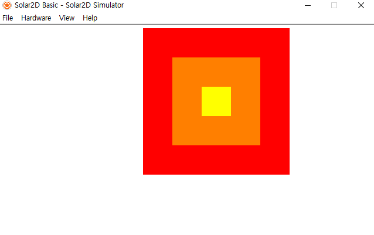  
		커서 위치와 오브젝트 위치가 맞지 않음
		+ 이유: object를 디스플레이 그룹에 넣은 채로 그룹 채로 위치 이동을 했기 때문!
		+ 해결 방법: 오브젝트를 드래그할때 오브젝트 그룹의 좌표값을 빼주면 됩니다.
		
		```lua
			event.target.x = event.xStart + event.xDelta - event.target.parent.x
			event.target.y = event.yStart + event.yDelta - event.target.parent.y
		```
		+ 수정 후  
		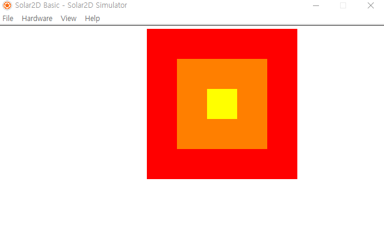  
<br>

#### ⏰ timer 이벤트 사용해보기
timer 이벤트는 앞 tap, touch 이벤트와 사용법이 약간 다름

* **timer.performWithDelay()**
	```lua
		timer.performWithDelay( delay, listener [, iterations] [, tag] )
	```
	- delay: 리스너 함수 실행까지 딜레이 시간
		+ 1000 = 1초
	- listener: 리스너 함수 이름
	- iterations: delay마다 반복 횟수
		+ 0 또는 -1은 무한 반복

* **추가 기능들**
	- timer.cancle( timerName ): 정지
	- timer.pause( timerName ): 일시 정지
	- timer.resume( timerName ): 재시작
	- timer.cancleAll(), timer.puaseAll(), timer.resumeAll()
		
* **일단 해보기**
	- 1초 뒤 울리는 알람 추가해보기
		```lua
			local function alarm( event )
				print("1초 뒤입니다.")
			end

			local timeAttack = timer.performWithDelay(1000, alarm)
		```
		+ 실행결과   
		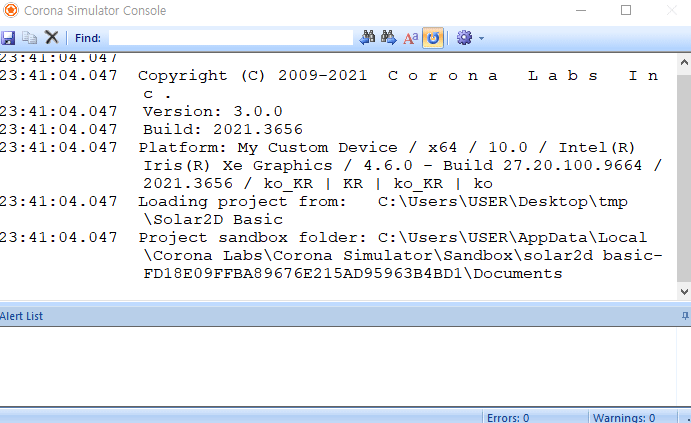
	
	- 10초를 세는 카운터 추가
		```lua
			local count = 1
			local function counter( event )
				print(count.."초가 지났습니다.")
				count = count + 1
			end

			local timeAttack = timer.performWithDelay(1000, counter, 10)
		```
		+ 실행결과  
		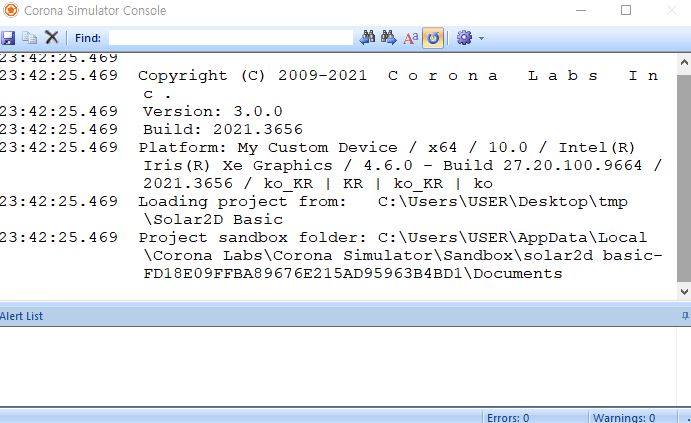

<br>

### 🎮 예제 게임 따라하기

#### 🎲 주사위 tap 이벤트 추가하기
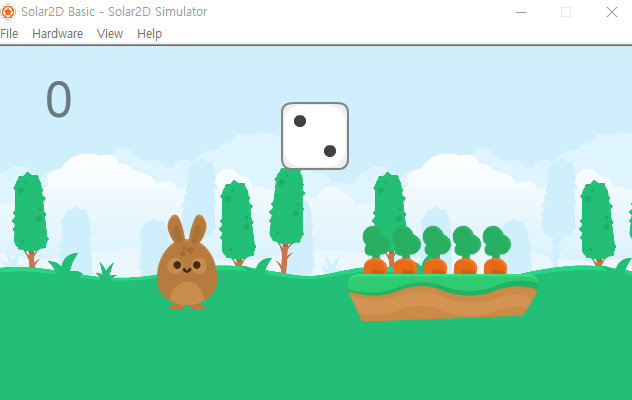  

* game.lua에서 이어서 코드 추가
	```lua
		local function tapDice( event )
			for i = 1, 6 do
				dice[i].alpha = 0 
			end
			dice[math.random(6)].alpha = 1
		end

		diceGroup:addEventListener("tap", tapDice)
	```

<br>

#### 🥕🥕🥕 당근 touch 이벤트 추가하기 feat.Drag
##### 일단 움직이기 하기
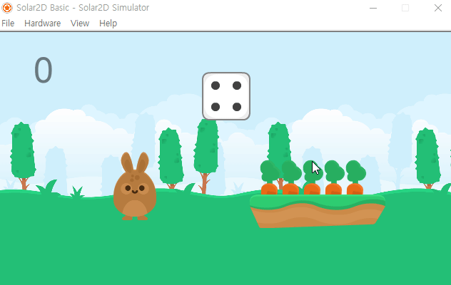   

* 코드 추가
	```lua
		local function dragCarrot( event )
			if( event.phase == "began" ) then
				display.getCurrentStage():setFocus( event.target )
				event.target.isFocus = true
				-- 드래그 시작할 때

			elseif( event.phase == "moved" ) then

				if ( event.target.isFocus ) then
					-- 드래그 중일 때
					event.target.x = event.xStart + event.xDelta
					event.target.y = event.yStart + event.yDelta
				end

			elseif ( event.phase == "ended" or event.phase == "cancelled") then
				if ( event.target.isFocus ) then
					display.getCurrentStage():setFocus( nil )
					event.target.isFocus = false
					-- 드래그 끝났을 때

				else
					display.getCurrentStage():setFocus( nil )
					event.target.isFocus = false
				end
			end
		end

		for i = 1, 5 do
			carrot[i]:addEventListener("touch", dragCarrot)
		end
	```


<br>

##### 🐰 당근을 토끼에게 주면 점수 얻기
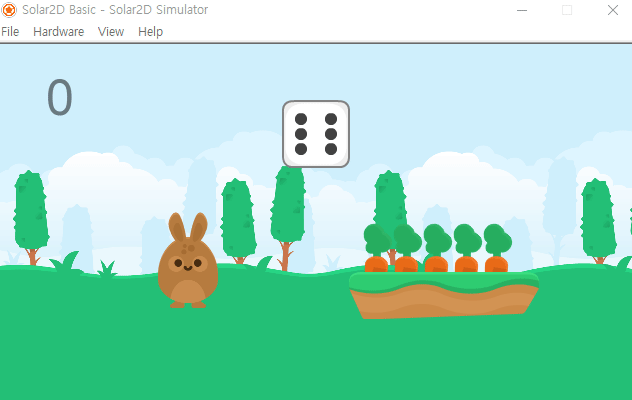  

* 코드 수정 
	```lua
		local function dragCarrot( event )
			if( event.phase == "began" ) then
				display.getCurrentStage():setFocus( event.target )
				event.target.isFocus = true
				-- 드래그 시작할 때

			elseif( event.phase == "moved" ) then

				if ( event.target.isFocus ) then
					-- 드래그 중일 때
					event.target.x = event.xStart + event.xDelta
					event.target.y = event.yStart + event.yDelta
				end

			elseif ( event.phase == "ended" or event.phase == "cancelled") then
				if ( event.target.isFocus ) then
					display.getCurrentStage():setFocus( nil )
					event.target.isFocus = false

					-- 드래그 끝났을 때
					if ( event.target.x > bunny.x - 50 and event.target.x < bunny.x + 50
						and event.target.y > bunny.y - 50 and event.target.y < bunny.y + 50) then

						display.remove(event.target) -- 당근 삭제하기
						score.text = score.text + 1 -- 점수 올리기
					end

				else
					display.getCurrentStage():setFocus( nil )
					event.target.isFocus = false
				end
			end
		end

		for i = 1, 5 do
			carrot[i]:addEventListener("touch", dragCarrot)
		end
	```

<br>

##### 🥕다른 곳에 당근을 두면 원래대로 돌아가기
  

* 이렇게 하면 될 것 같지만..?
	```lua
		elseif ( event.phase == "ended" or event.phase == "cancelled") then
			if ( event.target.isFocus ) then
				display.getCurrentStage():setFocus( nil )
				event.target.isFocus = false

				-- 드래그 끝났을 때
				if ( event.target.x > bunny.x - 50 and event.target.x < bunny.x + 50
					and event.target.y > bunny.y - 50 and event.target.y < bunny.y + 50) then

					display.remove(event.target) -- 당근 삭제하기
					score.text = score.text + 1 -- 점수 올리기
				else
					-- 원래 자리로 돌아가기
					event.target.x = event.xStart
					event.target.y = event.yStart
				end

			else
				display.getCurrentStage():setFocus( nil )
				event.target.isFocus = false
			end
		end
	```

	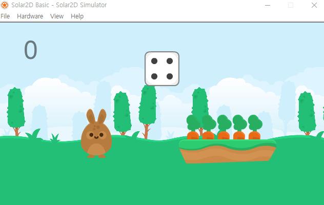  

	- 조금씩 오차가 생기는 것을 확인할 수 있습니다.
	
	- **해결방법**  
		+ event.target에 변수를 하나 달아두어 초기 좌표를 저장해서 사용합니다.
			* event.target.initX, event.target.initY

* 코드 수정
	```lua
		local function dragCarrot( event )
			if( event.phase == "began" ) then
				display.getCurrentStage():setFocus( event.target )
				event.target.isFocus = true
				-- 드래그 시작할 때
				event.target.initX = event.target.x
				event.target.initY = event.target.y

			elseif( event.phase == "moved" ) then

				if ( event.target.isFocus ) then
					-- 드래그 중일 때
					event.target.x = event.xStart + event.xDelta
					event.target.y = event.yStart + event.yDelta
				end

			elseif ( event.phase == "ended" or event.phase == "cancelled") then
				if ( event.target.isFocus ) then
					display.getCurrentStage():setFocus( nil )
					event.target.isFocus = false

					-- 드래그 끝났을 때
					if ( event.target.x > bunny.x - 50 and event.target.x < bunny.x + 50
						and event.target.y > bunny.y - 50 and event.target.y < bunny.y + 50) then

						display.remove(event.target) -- 당근 삭제하기
						score.text = score.text + 1 -- 점수 올리기
					else
						event.target.x = event.target.initX
						event.target.y = event.target.initY
					end

				else
					display.getCurrentStage():setFocus( nil )
					event.target.isFocus = false
				end
			end
		end

		for i = 1, 5 do
			carrot[i]:addEventListener("touch", dragCarrot)
		end
	```

<br>

#### ⏰ timer 이벤트 추가하기

* **저번 시간에 까먹은 Text 하나 추가하기**
	```lua
		local time= display.newText(10, display.contentWidth*0.9, display.contentHeight*0.15)
		time.size = 100
		time:setFillColor(0)
		time.alpha = 0.5

		sceneGroup:insert(time)
	```

* **timer 추가하기**  

	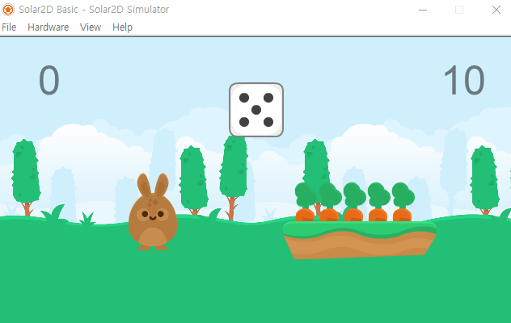  

	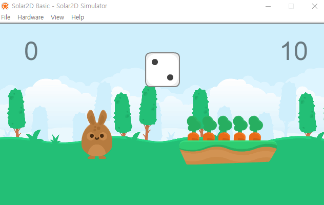  

	- 코드 수정 (drag 함수에 점수 올리기 다음 부분에)
		```lua
			if( score.text == '5') then
				score.text = '성공!'
				time.alpha = 0
			end
		```

	- 코드 추가
		```lua
		local function counter( event )
			time.text = time.text - 1
	
			if( time.text == '5' ) then
				time:setFillColor(1, 0, 0)
			end
	
			if( time.text == '-1') then
				time.alpha = 0
	
				if( score.text ~= '성공!' ) then
					score.text = '실패!'
					bunny:rotate(90)
					
					for i = 1, 5 do
						carrot[i]:removeEventListener("touch", dragCarrot)
					end
				end
			end
		end
	
		local timeAttack = timer.performWithDelay(1000, counter, 11)
		```


<br>

### 🕒 이번주 과제 안내

<br>

* **클릭하면 이동하는 tap 이벤트 만들기**  

	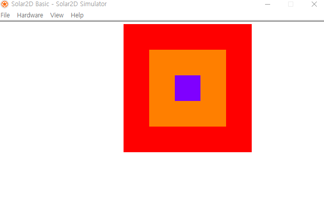  

	- view1.lua를 변형해서 위와 같은 예제를 만들어 이벤트 리스너 함수를 제출하세요.
	
	- 위 이미지와 동일하지 않아도 됩니다. 대충 탭하면 움직인다면 OK

	- [도전] 오브젝트가 화면 밖으로 나가지 않도록 해보기
