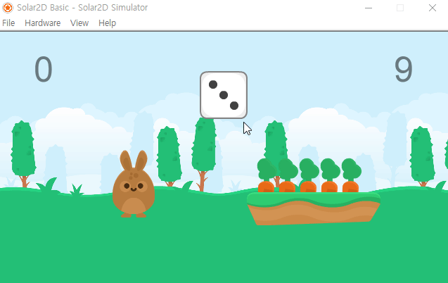
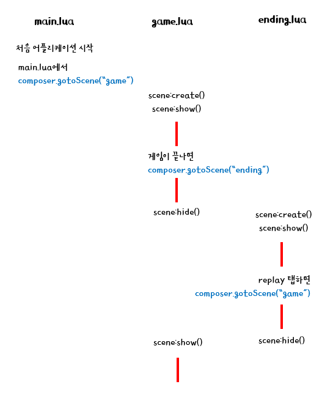
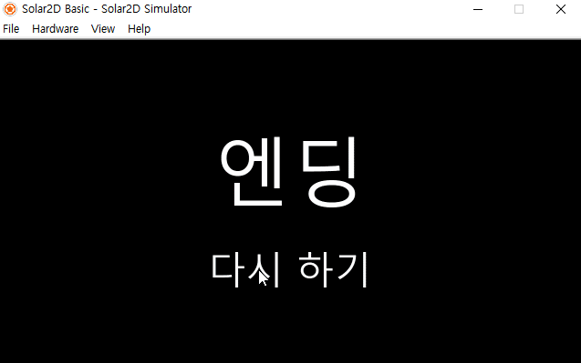
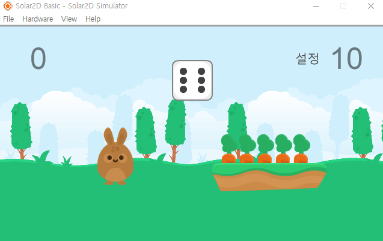
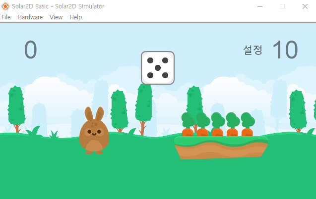
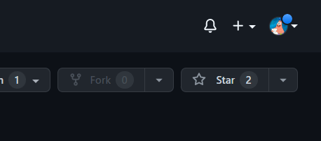
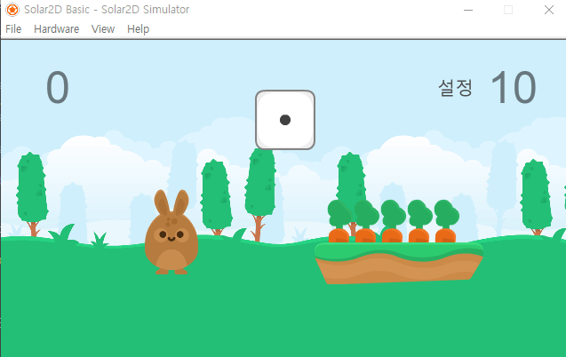

# 3️⃣ Scene

## 🏛 목차
* [event 이해하기](#-event-이해하기)
* [예제 게임 따라하기](#-예제-게임-따라하기)
* [이번주 과제 안내](#-이번주-과제-안내)

<br>

### 💡 개념 이해하기
🔗 [Composer Library](https://docs.coronalabs.com/guide/system/composer/index.html)
#### Composer란?
* Composer library는 Scene을 만들고, 전환하는 등의 기능을 제공하는 라이브러리이다.

* main.lua 살펴보기

	``` lua  
	local composer = require "composer"  -- include composer library
	
	local function onFirstView( event )  
		composer.gotoScene( "view1" ) -- view1에 해당하는 장면으로 이동
	end  

	onFirstView()  
	```

<br>
	
#### Scene 관련 이벤트
* Scene Event Funtion  

	- 
	| 함수 | 설명  |  
	| ---| --- |  
	| scene:create() | 처음에 scene이 생성되었을 때 |
	| scene:show() | scene이 화면에 나타나기 직전(will) / 직후(did) |
	| scene:hide() |  scene이 화면에서 사라지기 직전(will) / 직후(did)|
	| scene:destroy() | 장면이 삭제될 때 |

	

	- view1.lua 살펴보기
	
		``` lua  
		local composer = require( "composer" )  
		local scene = composer.newScene()

		function scene:create( event )
			local sceneGroup = self.view
			--
	
		end
	
		function scene:show( event )
			local sceneGroup = self.view
			local phase = event.phase
			
			if phase == "will" then
				--
	
			elseif phase == "did" then
				--
	
			end	
		end
	
		function scene:hide( event )
			local sceneGroup = self.view
			local phase = event.phase
			
			if event.phase == "will" then
				--
	
			elseif phase == "did" then
				--
	
			end
		end
	
		function scene:destroy( event )
			local sceneGroup = self.view
			--
	
		end
	
		---------------------------------------------------------------------------------
	
		-- Listener setup
		scene:addEventListener( "create", scene )
		scene:addEventListener( "show", scene )
		scene:addEventListener( "hide", scene )
		scene:addEventListener( "destroy", scene )
	
		-----------------------------------------------------------------------------------------
	
		return scene
		```
	
<br>
	
#### [scene 관련 함수](https://docs.coronalabs.com/api/library/composer/index.html)
다음은 scene 관련 함수들 중 일부입니다.

* scene 전환과 관련된 함수
	- composer.gotoScene()
	- composer.removeScene()
	- overlay 함수
		+ composer.showOverlay()
		+ composer.hideOverlay()
* scene 사이에서 변수를 주고 받기위한 함수
	+ composer.setVariable( variableName, value )
	- composer.getVariable( variableName )
	
<br>

### 🎮 예제 게임 따라하기

#### 1. 새로운 씬 만들기

##### i. ending.lua
```lua
-----------------------------------------------------------------------------------------
--
-- ending.lua
--
-----------------------------------------------------------------------------------------

local composer = require( "composer" )
local scene = composer.newScene()


function scene:create( event )
	local sceneGroup = self.view
	
 	local endingText = display.newText("엔딩", display.contentWidth/2, display.contentHeight*0.4)
 	endingText.size = 200

 	local replay = display.newText("다시 하기", display.contentWidth/2, display.contentHeight*0.7)
	replay.size = 100

 	function replay:tap( event )
 		--
 	end

 	replay:addEventListener("tap", replay)

	sceneGroup:insert(endingText)
	sceneGroup:insert(replay)
end

function scene:show( event )
	local sceneGroup = self.view
	local phase = event.phase
	
	if phase == "will" then
		-- Called when the scene is still off screen and is about to move on screen
	elseif phase == "did" then
		-- Called when the scene is now on screen
		-- 
		-- INSERT code here to make the scene come alive
		-- e.g. start timers, begin animation, play audio, etc.

	end	
end

function scene:hide( event )
	local sceneGroup = self.view
	local phase = event.phase
	
	if event.phase == "will" then
		-- Called when the scene is on screen and is about to move off screen
		--
		-- INSERT code here to pause the scene
		-- e.g. stop timers, stop animation, unload sounds, etc.)
	elseif phase == "did" then
		-- Called when the scene is now off screen

	end
end

function scene:destroy( event )
	local sceneGroup = self.view
	
	-- Called prior to the removal of scene's "view" (sceneGroup)
	-- 
	-- INSERT code here to cleanup the scene
	-- e.g. remove display objects, remove touch listeners, save state, etc.
end

---------------------------------------------------------------------------------

-- Listener setup
scene:addEventListener( "create", scene )
scene:addEventListener( "show", scene )
scene:addEventListener( "hide", scene )
scene:addEventListener( "destroy", scene )

-----------------------------------------------------------------------------------------

return scene

```

##### ii. setting.lua
```lua
-----------------------------------------------------------------------------------------
--
-- setting.lua
--
-----------------------------------------------------------------------------------------

local composer = require( "composer" )
local scene = composer.newScene()


function scene:create( event )
	local sceneGroup = self.view
	
 	local background = display.newRoundedRect(display.contentWidth/2, display.contentHeight/2, display.contentWidth/2, display.contentHeight*0.6, 55)
 	background.strokeWidth = 10
	background:setStrokeColor( 0.4, 0.2, 0.2 )
 	background:setFillColor(0.6, 0.5, 0.5)

 	local title = display.newText("Setting", display.contentWidth/2, display.contentHeight*0.3)
 	title.size = 70

 	function title:tap( event )
 		--
 	end
 	title:addEventListener("tap", title)

 	sceneGroup:insert(background)
 	sceneGroup:insert(title)
end

function scene:show( event )
	local sceneGroup = self.view
	local phase = event.phase
	
	if phase == "will" then
		-- Called when the scene is still off screen and is about to move on screen
	elseif phase == "did" then
		-- Called when the scene is now on screen
		-- 
		-- INSERT code here to make the scene come alive
		-- e.g. start timers, begin animation, play audio, etc.

	end	
end

function scene:hide( event )
	local sceneGroup = self.view
	local phase = event.phase
	
	if event.phase == "will" then
		-- Called when the scene is on screen and is about to move off screen
		--
		-- INSERT code here to pause the scene
		-- e.g. stop timers, stop animation, unload sounds, etc.)
	elseif phase == "did" then
		-- Called when the scene is now off screen

	end
end

function scene:destroy( event )
	local sceneGroup = self.view
	
	-- Called prior to the removal of scene's "view" (sceneGroup)
	-- 
	-- INSERT code here to cleanup the scene
	-- e.g. remove display objects, remove touch listeners, save state, etc.
end

---------------------------------------------------------------------------------

-- Listener setup
scene:addEventListener( "create", scene )
scene:addEventListener( "show", scene )
scene:addEventListener( "hide", scene )
scene:addEventListener( "destroy", scene )

-----------------------------------------------------------------------------------------

return scene
```

#### 2. ending.lua 연결하기
* game.lua에서 게임 성공했을 때, 실패했을 때 ending.lua로 이동
``` lua
	local function dragCarrot( event )
		...

		if( score.text == '5' ) then
			score.text = '성공!'
			time.alpha = 0

			composer.gotoScene("ending") -- 추가
		end
	...

	local function counter ( event )
		...
		if( time.text == '-1') then
			...
			composer.gotoScene("ending") -- 추가
		end
	...
```

* ending.lua에서 replay를 클릭하면, 다시 game.lua로 이동
``` lua
 	function replay:tap( event )
 		composer.gotoScene('game')
 	end
```

<br>

**실행 결과**



* 게임이 끝났을 때 정상적으로 ending.lua로 이동
* 그러나, 다시 game으로 돌아오면 원래 상태 그대로!

<br>

* 다시 돌아왔을때 다시 시작하려면 어떻게 해야할까? 



* 처음 scene을 불러올 때 create()와 show()가 실행되고,
* 그 이후에는 show()만 실행되는 형식

<br>

**해결 방법**  

* hide()에서 씬을 삭제해서, 다시 돌아올 때마다 새롭게 scene이 생성되도록 한다.

``` lua
function scene:hide( event )
	local sceneGroup = self.view
	local phase = event.phase
	
	if event.phase == "will" then
		-- Called when the scene is on screen and is about to move off screen
		--
		-- INSERT code here to pause the scene
		-- e.g. stop timers, stop animation, unload sounds, etc.)
		
		composer.removeScene('game') -- 추가

	elseif phase == "did" then
		-- Called when the scene is now off screen
	end
end
```

**중요! timer는 장면이 전환되어도 계속 돌아가기 때문에, 필요가 없다면 timer를 꼭 삭제해주어야 합니다**

* create()와 hide() 둘다 변수에 접근할 수 있도록 함수 밖에 변수를 선언해줍니다.
```lua
local composer = require( "composer" )
local scene = composer.newScene()

local timeAttack

function scene:create( event )
	 ...
	 -- 앞에서 변수를 선언했기 때문에 앞에 local를 제거해준다.
	 timeAttack = timer.performWithDelay(1000, counter, 11)
```

* timer를 정지하는 코드를 작성해줍니다.
```lua
function scene:hide( event )
	local sceneGroup = self.view
	local phase = event.phase
	
	if event.phase == "will" then
		-- Called when the scene is on screen and is about to move off screen
		--
		-- INSERT code here to pause the scene
		-- e.g. stop timers, stop animation, unload sounds, etc.)

		composer.removeScene('game')
		timer.cancel(timeAttack) -- 추가

	elseif phase == "did" then
		-- Called when the scene is now off screen
	end
end
```
  

* 정상적으로 실행됩니다.

<br>

**왜 will에다가 작성하나요??**

* did에다가 작성할 경우, 오류는 나지 않지만 가끔 scene을 삭제하는 타이밍이 늦어서 이미지가 깨지는 현상이 나타납니다!

  


#### 3. setting.lua 연결하기
* create()에 추가한다.
``` lua
 	local setting = display.newText("설정", display.contentWidth*0.8, display.contentHeight*0.15)
 	setting.size = 50
 	setting:setFillColor(0.3)

 	function setting:tap( event )
 		--
 	end
 	setting:addEventListener("tap", setting)

 	sceneGroup:insert(setting)
```

* setting 창 띄우기 (game.lua)
``` lua
	function setting:tap( event )
 		composer.showOverlay('setting')
 	end
```

* setting 창 지우기 (setting.lua)
``` lua
 	function title:tap( event )
 		composer.hideOverlay('setting')
 	end
 	title:addEventListener("tap", title)
```

**실행 결과**  

  

**setting 창 띄울 때 timer 일시정지**  

* timeAttack을 일시정지하고, setting에서 timeAttack에 접근할 수 있게 composer.setVariable()로 값을 넘긴다.
```lua
 	function setting:tap( event )
 		timer.pause(timeAttack)
 		composer.setVariable( "timeAttack", timeAttack )

 		composer.showOverlay('setting')
 	end
 	setting:addEventListener("tap", setting)
```

* composer.getVariable()로 값을 받아와서 timeAttack을 재개한다.  

 

**또다른 방법?**

* 타이머를 그냥 전역변수로 선언해서 다른 lua에서도 접근할 수 있도록 할 수도 있습니다.
* TIP: 전역 변수는 헷갈리지 않게 main.lua에 선언해서 사용하기 

<br>

### 🕒 이번주 과제 안내
*  (선택 과제) Lua 스터디 깃허브 북마크하기
	* 지금까지의 스터디가 도움이 되셨다면 위에 좌측 상단에 star 버튼을 눌러주세요!
		- 깃허브 아이디가 없다면 이번 기회에 회원가입 해보는 것도 좋습니다!

	 

<br>


*  ending에서 게임 결과에 따라서 endingText.text가 다르게 나타나게 변경해보세요. 프로젝트를 전체 압축해서 제출합니다.
	- 힌트: composer.setVariable(), composer.getVariable()를 이용한다.

	 

* 추가 과제(선택): game.lua에서 배경음악을 추가해보세요!
	- 조건 1: ending.lua로 넘어갈 때는 배경음악을 멈출 것 or 다른 배경음악을 틀 것
	- 조건 2: setting.lua가 보여질 때는 배경음악이 그대로 들리게 할 

<br>

#### 📚 [제출 폼 링크](https://forms.gle/YBkNfMRhko5yadhG9)