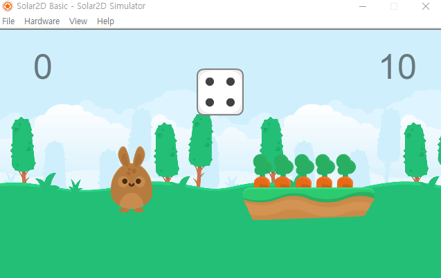

# 3️⃣ Scene

## 🏛 목차
* [event 이해하기](#-event-이해하기)
* [예제 게임 따라하기](#-예제-게임-따라하기)
* [이번주 과제 안내](#-이번주-과제-안내)

<br>

### 💡 개념 이해하기
🔗 [Composer Library](https://docs.coronalabs.com/guide/system/composer/index.html)
#### Composer란?
* Composer library는 Scene을 만들고, 전환하는 등의 기능을 제공하는 라이브러리이다.

* main.lua 살펴보기

	``` lua  
	local composer = require "composer"  -- include composer library
	
	local function onFirstView( event )  
		composer.gotoScene( "view1" ) -- view1에 해당하는 장면으로 이동
	end  

	onFirstView()  
	```

<br>
	
#### Scene 관련 이벤트
* Scene Event Funtion  

	- 
	| 함수 | 설명  |  
	| ---| --- |  
	| scene:create() | 처음에 scene이 생성되었을 때 |
	| scene:show() | scene이 화면에 나타나기 직전(will) / 직후(did) |
	| scene:hide() |  scene이 화면에서 사라지기 직전(will) / 직후(did)|
	| scene:destroy() | 장면이 삭제될 때 |

	

	- view1.lua 살펴보기
	
		``` lua  
		local composer = require( "composer" )  
		local scene = composer.newScene()

		function scene:create( event )
			local sceneGroup = self.view
			--
	
		end
	
		function scene:show( event )
			local sceneGroup = self.view
			local phase = event.phase
			
			if phase == "will" then
				--
	
			elseif phase == "did" then
				--
	
			end	
		end
	
		function scene:hide( event )
			local sceneGroup = self.view
			local phase = event.phase
			
			if event.phase == "will" then
				--
	
			elseif phase == "did" then
				--
	
			end
		end
	
		function scene:destroy( event )
			local sceneGroup = self.view
			--
	
		end
	
		---------------------------------------------------------------------------------
	
		-- Listener setup
		scene:addEventListener( "create", scene )
		scene:addEventListener( "show", scene )
		scene:addEventListener( "hide", scene )
		scene:addEventListener( "destroy", scene )
	
		-----------------------------------------------------------------------------------------
	
		return scene
		```
	
<br>
	
#### [scene 관련 함수](https://docs.coronalabs.com/api/library/composer/index.html)
다음은 scene 관련 함수들 중 일부입니다.

* scene 전환과 관련된 함수
	- composer.gotoScene()
	- composer.removeScene()
	- overlay 함수
		+ composer.showOverlay()
		+ composer.hideOverlay()
* scene 사이에서 변수를 주고 받기위한 함수
	+ composer.setVariable( variableName, value )
	- composer.getVariable( variableName )
	
<br>

### 🎮 예제 게임 따라하기

#### 1. 새로운 씬 만들기

##### i. ending.lua
```lua
-----------------------------------------------------------------------------------------
--
-- ending.lua
--
-----------------------------------------------------------------------------------------

local composer = require( "composer" )
local scene = composer.newScene()


function scene:create( event )
	local sceneGroup = self.view
	
 	local endingText = display.newText("엔딩", display.contentWidth/2, display.contentHeight*0.4)
 	endingText.size = 200

 	local replay = display.newText("다시 하기", display.contentWidth/2, display.contentHeight*0.7)
	replay.size = 100

 	function replay:tap( event )
 		--
 	end

 	replay:addEventListener("tap", replay)

	sceneGroup:insert(endingText)
	sceneGroup:insert(replay)
end

function scene:show( event )
	local sceneGroup = self.view
	local phase = event.phase
	
	if phase == "will" then
		-- Called when the scene is still off screen and is about to move on screen
	elseif phase == "did" then
		-- Called when the scene is now on screen
		-- 
		-- INSERT code here to make the scene come alive
		-- e.g. start timers, begin animation, play audio, etc.

	end	
end

function scene:hide( event )
	local sceneGroup = self.view
	local phase = event.phase
	
	if event.phase == "will" then
		-- Called when the scene is on screen and is about to move off screen
		--
		-- INSERT code here to pause the scene
		-- e.g. stop timers, stop animation, unload sounds, etc.)
	elseif phase == "did" then
		-- Called when the scene is now off screen

	end
end

function scene:destroy( event )
	local sceneGroup = self.view
	
	-- Called prior to the removal of scene's "view" (sceneGroup)
	-- 
	-- INSERT code here to cleanup the scene
	-- e.g. remove display objects, remove touch listeners, save state, etc.
end

---------------------------------------------------------------------------------

-- Listener setup
scene:addEventListener( "create", scene )
scene:addEventListener( "show", scene )
scene:addEventListener( "hide", scene )
scene:addEventListener( "destroy", scene )

-----------------------------------------------------------------------------------------

return scene

```

##### ii. setting.lua
```lua
-----------------------------------------------------------------------------------------
--
-- setting.lua
--
-----------------------------------------------------------------------------------------

local composer = require( "composer" )
local scene = composer.newScene()


function scene:create( event )
	local sceneGroup = self.view
	
 	local background = display.newRoundedRect(display.contentWidth/2, display.contentHeight/2, display.contentWidth/2, display.contentHeight*0.6, 55)
 	background.strokeWidth = 10
	background:setStrokeColor( 0.4, 0.2, 0.2 )
 	background:setFillColor(0.6, 0.5, 0.5)

 	local title = display.newText("Setting", display.contentWidth/2, display.contentHeight*0.3)
 	title.size = 70

 	function title:tap( event )
 		--
 	end
 	title:addEventListener("tap", title)

 	sceneGroup:insert(background)
 	sceneGroup:insert(title)
end

function scene:show( event )
	local sceneGroup = self.view
	local phase = event.phase
	
	if phase == "will" then
		-- Called when the scene is still off screen and is about to move on screen
	elseif phase == "did" then
		-- Called when the scene is now on screen
		-- 
		-- INSERT code here to make the scene come alive
		-- e.g. start timers, begin animation, play audio, etc.

	end	
end

function scene:hide( event )
	local sceneGroup = self.view
	local phase = event.phase
	
	if event.phase == "will" then
		-- Called when the scene is on screen and is about to move off screen
		--
		-- INSERT code here to pause the scene
		-- e.g. stop timers, stop animation, unload sounds, etc.)
	elseif phase == "did" then
		-- Called when the scene is now off screen

	end
end

function scene:destroy( event )
	local sceneGroup = self.view
	
	-- Called prior to the removal of scene's "view" (sceneGroup)
	-- 
	-- INSERT code here to cleanup the scene
	-- e.g. remove display objects, remove touch listeners, save state, etc.
end

---------------------------------------------------------------------------------

-- Listener setup
scene:addEventListener( "create", scene )
scene:addEventListener( "show", scene )
scene:addEventListener( "hide", scene )
scene:addEventListener( "destroy", scene )

-----------------------------------------------------------------------------------------

return scene
```

#### 2. ending.lua 연결하기
* game.lua에서 게임 성공했을 때, 실패했을 때 ending.lua로 이동
``` lua
	local function dragCarrot( event )
		...

		if( score.text == '5' ) then
			score.text = '성공!'
			time.alpha = 0

			composer.gotoScene("ending") -- 추가
		end
	...

	local function counter ( event )
		...
		if( time.text == '-1') then
			...
			composer.gotoScene("ending") -- 추가
		end
	...
```

* ending.lua에서 replay를 클릭하면, 다시 game.lua로 이동
``` lua
 	function replay:tap( event )
 		composer.gotoScene('game')
 	end
```

<br>

**실행 결과**


* 게임이 끝났을 때 정상적으로 ending.lua로 이동
* 그러나, 다시 game으로 돌아오면 원래 상태 그대로!

<br>

* 다시 돌아왔을때 다시 시작하려면 어떻게 해야할까? 


* 처음 scene을 불러올 때 create()와 show()가 실행되고,
* 그 이후에는 show()만 실행되는 형식

<br>

**해결 방법**  

1. hide()에서 씬을 삭제해서, 다시 돌아올 때마다 새롭게 scene이 생성되도록 한다.
2. 다시 돌아올 때마다 실행되는 show()에 리셋 되어야할 부분들을 작성한다.

여기서는 2 방법으로 해본다.

* 게임 진행에 직접적으로 상관이 없는 부분은 create()에
	- background, dice를 create()에 남겨둔다
* 게임 진행에 직접적으로 상관이 있는 부분은 show()에 옮긴다.
	- bunny, carrot, score, time과 그 와 관련된 이벤트 함수들

<br>

* scene:create()
```lua
function scene:create( event )
	local sceneGroup = self.view
	
	local background = display.newImageRect("image/background.png", display.contentWidth, display.contentHeight)
	background.x, background.y = display.contentWidth/2, display.contentHeight/2

	local diceGroup = display.newGroup();
	local dice = {}

	for i = 1, 6 do
		dice[i] = display.newImage(diceGroup, "image/dice ("..i..").png")
		dice[i].x, dice[i].y = display.contentWidth*0.5, display.contentHeight*0.25

		dice[i]:scale(2, 2)
		dice[i].alpha = 0
	end
	dice[math.random(6)].alpha = 1

	local function tapDice( event )
		for i = 1, 6 do
			dice[i].alpha = 0
		end
		dice[math.random(6)].alpha = 1
	end

	diceGroup:addEventListener("tap", tapDice)

	-- 레이어 정리
	sceneGroup:insert(background)
	sceneGroup:insert(diceGroup)
end
```

* scene:show()
``` lua
function scene:show( event )
	local sceneGroup = self.view
	local phase = event.phase
	
	if phase == "will" then
		-- Called when the scene is still off screen and is about to move on screen
	elseif phase == "did" then
		-- Called when the scene is now on screen
		-- 
		-- INSERT code here to make the scene come alive
		-- e.g. start timers, begin animation, play audio, etc.

		local bunny = display.newImage("image/bunny.png")
		bunny.x, bunny.y = display.contentWidth*0.3, display.contentHeight*0.6

		local ground = display.newImage("image/ground.png")
		ground.x, ground.y = display.contentWidth*0.7, display.contentHeight*0.7

		local carrotGroup = display.newGroup()
		local carrot = {}

		for i = 1, 5 do
			carrot[i] = display.newImageRect(carrotGroup, "image/carrot.png", 60, 150)
			carrot[i].x, carrot[i].y = display.contentWidth*0.55 + 60*i, display.contentHeight*0.6
		end

		local score = display.newText(0, display.contentWidth*0.1, display.contentHeight*0.15)

		score.size = 100
		score:setFillColor(0)
		score.alpha = 0.5

		local time = display.newText(10, display.contentWidth*0.9, display.contentHeight*0.15)

		time.size = 100
		time:setFillColor(0)
		time.alpha = 0.5

		-- 레이어 정리
		sceneGroup:insert(bunny)
		sceneGroup:insert(ground)
		sceneGroup:insert(carrotGroup)
		sceneGroup:insert(score)
		sceneGroup:insert(time)

		ground:toFront()

	 	local function dragCarrot( event )
	 		if( event.phase == "began" ) then
	 			display.getCurrentStage():setFocus( event.target )
	 			event.target.isFocus = true
	 			-- 드래그 시작할 때
	 			event.target.initX = event.target.x
				event.target.initY = event.target.y
	 		elseif( event.phase == "moved" ) then

	 			if ( event.target.isFocus ) then
	 				-- 드래그 중일 때
	 				event.target.x = event.xStart + event.xDelta
	 				event.target.y = event.yStart + event.yDelta
	 			end

	 		elseif ( event.phase == "ended" or event.phase == "cancelled") then
	 			display.getCurrentStage():setFocus( nil )
	 			event.target.isFocus = false
	 			-- 드래그 끝났을 때
	 			if( event.target.x > bunny.x - 50 and event.target.x < bunny.x + 50
	 				and event.target.y > bunny.y -50 and event.target.y < bunny.y + 50) then

	 				display.remove( event.target )
	 				score.text = score.text + 1

	 				if( score.text == '5' ) then
	 					score.text = '성공!'
	 					time.alpha = 0

	 					composer.gotoScene("ending")
	 				end

	 			else 
	 				event.target.x = event.target.initX
	 				event.target.y = event.target.initY
	 			end
	 		end
	 	end

	 	for i = 1, 5 do
	 		carrot[i]:addEventListener("touch", dragCarrot)
	 	end

	 	local function counter ( event )
	 		time.text = time.text - 1

	 		if( time.text == '5' ) then
	 			time:setFillColor(1, 0, 0)
	 		end

	 		if( time.text == '-1') then
	 			time.alpha = 0

	 			if( score.text ~= '성공!' ) then
	 				score.text = "실패!"
	 				bunny:rotate(90)

	 				for i = 1, 5 do
				 		carrot[i]:removeEventListener("touch", dragCarrot)
				 	end
	 			end
	 			composer.gotoScene("ending") 
	 		end
	 	end

	 	timeAttack = timer.performWithDelay(1000, counter, 11)
	end	
end
```

**실행 결과**  
  

1. 돌아왔을 때 이전 오브젝트와 겹친다.
2. 이전 타이머가 남아있어서, 타이머가 다 되었을때 다시 ending으로 돌아와버림

<br>

**해결 방법**  

1. show()에서 생성된 diplay object들을 모아서 hide()에서 삭제한다. 
2. timer을 hide()에서 정지한다.

<br>

* show()에서 사용하는 변수들을 hide()에서도 접근하기 위해 함수 밖에 선언한다.
```lua
local composer = require( "composer" )
local scene = composer.newScene()

-- 변수 선언
local gameGroup
local timeAttack

function scene:create( event )
	...
```

* show()에서 오브젝트들을 gameGroup에 담기
``` lua
	-- 레이어 정리
	gameGroup = display.newGroup()

	gameGroup:insert(bunny)
	gameGroup:insert(ground)
	gameGroup:insert(carrotGroup)
	gameGroup:insert(score)
	gameGroup:insert(time)

	ground:toFront()

	sceneGroup:insert(gameGroup)
```

* 앞에서 변수를 선언했으니, local 빼주기
```lua
	timeAttack = timer.performWithDelay(1000, counter, 11)
```

* hide()에 필요한 코드 추가
``` lua
function scene:hide( event )
	local sceneGroup = self.view
	local phase = event.phase
	
	if event.phase == "will" then
		-- Called when the scene is on screen and is about to move off screen
		--
		-- INSERT code here to pause the scene
		-- e.g. stop timers, stop animation, unload sounds, etc.)
	elseif phase == "did" then
		-- Called when the scene is now off screen

		-- 추가
		timer.cancel(timeAttack)
		display.remove(gameGroup)
	end
end
```

  

#### 3. setting.lua 연결하기
* game에 직접적으로 연관된 부분이 아니기 때문에, create()에 추가한다. 
``` lua
 	local setting = display.newText("설정", display.contentWidth*0.8, display.contentHeight*0.15)
 	setting.size = 50
 	setting:setFillColor(0.3)

 	function setting:tap( event )
 		
 	end
 	setting:addEventListener("tap", setting)

 	sceneGroup:insert(setting)
```

* setting 창 띄우기 (game.lua)
``` lua
	function setting:tap( event )
 		composer.showOverlay('setting')
 	end
```

* setting 창 지우기 (setting.lua)
``` lua
 	function title:tap( event )
 		composer.hideOverlay('setting')
 	end
 	title:addEventListener("tap", title)
```

**실행 결과**  

  

**setting 창 띄울 때 timer 일시정지**  

* timeAttack을 일시정지하고, setting에서 timeAttack에 접근할 수 있게 composer.setVariable()로 값을 넘긴다.
```lua
 	function setting:tap( event )
 		timer.pause(timeAttack)
 		composer.setVariable( "timeAttack", timeAttack )

 		composer.showOverlay('setting')
 	end
 	setting:addEventListener("tap", setting)
```

* composer.getVariable()로 값을 받아와서 timeAttack을 재개한다.  

 
<br>

### 🕒 이번주 과제 안내
*  (선택 과제) Lua 스터디 깃허브 북마크하기
	* 지금까지의 스터디가 도움이 되셨다면 위에 좌측 상단에 star 버튼을 눌러주세요!
		- 깃허브 아이디가 없다면 이번 기회에 회원가입 해보는 것도 좋습니다!

	 

<br>


*  ending에서 게임 결과에 따라서 endingText.text가 다르게 나타나게 변경해보세요. 프로젝트를 전체 압축해서 제출합니다.
	- 힌트: composer.setVariable(), composer.getVariable()를 이용한다.

	 

<br>

#### 📚 [제출 폼 링크](https://forms.gle/YBkNfMRhko5yadhG9)