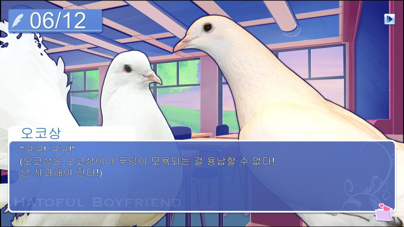
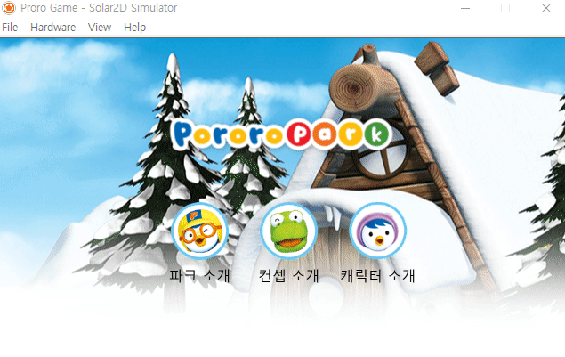
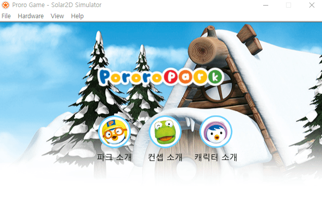

# 4️⃣-1️⃣  대화형 게임 제작 기초

## 🏛 목차
* [대화형 게임에서 왜 json?](#대화형-게임에서-왜-json)
* [json으로 정보 불러오기](#json으로-정보-불러오기)
* [캐릭터 소개 파트 완성하기](#json으로-캐릭터-소개-파트-완성하기)
* [대화형 게임 제작 따라하기](#대화형-게임-제작-따라하기)
* [과제 안내](#과제-안내)

<br>

### 대화형 게임에서 왜 json?
* **json이란**
	- 일종의 데이터 교환 양식
	- javaScript Object Notation: javascript 객체 문법으로 구조화된 데이터를 표현하기 위한 문자 기반의 표준 포맷 

* **대화형 게임을 만들 때 json을 활용해보자..!**  

	  

	- json으로 관리한다면?  
		+ 한 장면에 관련된 여러 정보를 한꺼번에 저장해서 관리할 수 있다. 그리고, 
	
		```json
		[
			{
				"background" : "image/뽀로로 집.png",
				"speaker" : "뽀로로",
				"image" : "image/pororo.png",
				"content" : "노는게 제일 좋아~"
			},
			{
				"background" : "image/놀이터.png",
				"speaker" : "크롱",
				"image" : "image/crong.png",
				"content" : "친구들 모여라~"
			}
		]
		```
		
		+ [🔗 JSON 파일에 대한 자세한 설명](http://www.tcpschool.com/json/json_basic_structure)
		
		+ 대충 이해하기
			* 큰 배열 [ ]에, { } 데이터 묶음 여러개 작성함.
			* { } 데이터 묶음 속에
				- "속성 이름" : "값"
		+  데이터 포맷이 다 같아야 하는 것은 아니다.
	
			* 사용 예시  
			
				``` json
				[
					{
						"type" : "background",
						"image" : "image/뽀로로네 집.png"
					},
					{
						"type" : "dialog",
						"speaker" : "뽀로로",
						"image" : "image/pororo.png",
						"content" : "노는게 제일 좋아~"
					},
					{
						"type" : "sound",
						"sound" : "sound/놀이터 소리.mp3"
					}
					...
				]
				```

		+ (Tip). json 파일 입출력을 활용해 세이브/로드 기능을 구현할 수도 있다! [관련 QnA](../QnA/02.md)
		+ [파일 입출력 가이드](https://docs.coronalabs.com/guide/data/readWriteFiles/index.html)

<br>

### json으로 정보 불러오기
[🔗 실습할 프로젝트 다운로드](https://github.com/HeoJiye/Lua_study/raw/main/image/week04-1/Proro%20Park.zip)

#### main.lua에 json 파싱 함수 작성하기
* **json 파싱이란?**
	- json 파일을 읽어들여서 **system.pathForFile()** 
	- lua에서 사용할 수 있는 데이터로 다듬는 **json.decodeFile()** 과정
		+ json.decodeFile()의 반대는 [json.encode()](https://docs.coronalabs.com/api/library/json/encode.html)
	- 다 Solar2D 기본 기능에 있기 때문에, 함수 호출로 간단하게 파싱 가능.

``` lua
-- json parsing
local json = require "json"

function jsonParse( src )
	local filename = system.pathForFile( src )
	
	local data, pos, msg
	data, pos, msg = json.decodeFile(filename)

	-- 디버깅
	if data then
		return data
	else
		print("WARNING: " .. pos, msg)
		return nil
	end
end
```

<br>

### json으로 캐릭터 소개 파트 완성하기
 

**character_info.json 살펴보기**
``` json
[
	{
		"name" : "뽀로로",
		"info" : "호기심 많은 꼬마 팽귄",
		"image" : "image/pororo.png"
	},
	{
		"name" : "크롱",
		"info" : "귀여운 말썽꾸러기 아기 공룡",
		"image" : "image/crong.png"
	},
	...
]
```


**character_info.lua 작성하기**
```lua
	-- json에서 정보 읽기
	local Data = jsonParse( "json/character_info.json" )
	if Data then
		print(Data[1].name) -- "뽀로로""
		print(Data[1].info) -- "호기심 많은 꼬마 펭귄""
		print(Data[1].image) -- "image/pororo.png"
	end
```

* main.lua에 선언해둔 전역함수 jsonParse를 이용해 파싱한 데이터를 Data에 담는다.

* 파싱된 데이터 접근하기
	- 배열로 데이터 묶음에 접근
	- 속성으로 속성 값에 접근

```lua
	-- CONTENT
	local content = display.newGroup()

	local image = {}
	local name = {}
	local info = {}

	for i = 1, #Data do
		image[i] = display.newImage(content, Data[i].image)
		image[i].x, image[i].y = display.contentWidth*0.2 + 400*(i-1), display.contentHeight*0.5
		image[i]:scale(1.5, 1.5)

		name[i] = display.newText(content, Data[i].name, image[i].x, image[i].y + 200)
		name[i].size = 50
		name[i]:setFillColor(0)

		info[i] = display.newText(content, Data[i].info, image[i].x, image[i].y + 250)
		info[i].size = 30
		info[i]:setFillColor(0)
	end
```

<br>

### 대화형 게임 제작 따라하기

 

**intro.json 살펴보기**
```json
[
	{
		"speaker": "뽀로로",
		"image" : "image/pororo.png",
		"content" : "뽀로로파크는 어떤 곳일까요?"
	},
	{
		"speaker": "루피",
		"image" : "image/loppy.png",
		"content" : "뽀로로파크는 놀이를 하면서 교육 효과를 창출하는 에듀테인먼트(edutainment) 공간이며,"
	},
	...
]
```

* speaker, image, content로 이루어진 간단한 스크립트 파일이다.  

**intro.lua 작성하기**
```lua
	-- json에서 정보 읽기
	local Data = jsonParse( "json/intro.json" )
	if Data then
		print(Data[1].speaker)
		print(Data[1].content)
		print(Data[1].image)
	end
```

```lua
	-- json에서 읽은 정보 적용하기
	local index = 0

	local function nextScript( event )
		index = index + 1
		if(index > #Data) then 
			composer.gotoScene("home") 
			return
		end

		speakertext = Data[index].speaker
		content.text = Data[index].content
		image.fill = {
			type = "image",
			filename = Data[index].image
		}
	end
	bg[1]:addEventListener("tap", nextScript)

	nextScript()
```

* 한번 생성한 이미지를 계속 바꾸는 방법
	- 일단 **display.newRect()**으로 생성한 다음에
	- **object.fill** 속성을 이용해 채우기 이미지를 변경한다. 

<br>

### 과제 안내
* **concept.json을 이용해서 다음과 같이 concept.lua를 완성해보세요.**

	 
