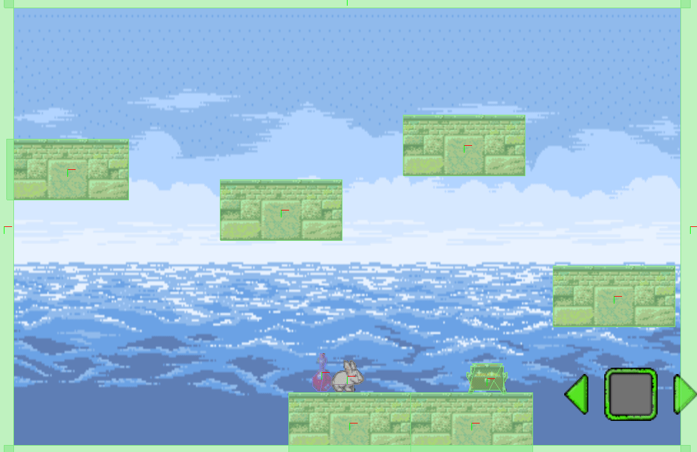

# 4️⃣ physics

## 🏛 목차
* [event 이해하기](#-event-이해하기)
* [예제 게임 따라하기](#-예제-게임-따라하기)
* [이번주 과제 안내](#-이번주-과제-안내)

<br>

### 💡 개념 이해하기
🔗 [physics Library](https://docs.coronalabs.com/guide/system/composer/index.html)
* physics library는 물리 엔진을 제공하는 라이브러리이다.
* 물리 엔진이란? 게임의 오브젝트에 실제 세계의 물리 법칙에 따라 움직이도록 처리해주는 프로그램이며 Solar 2D는 편리하게 현실 세계의 물리를 게임 세계에서도 유사하게 구현할 수 있도록 Physics 라이브러리를 제공하고 있습니다.

<br>

#### Physics 라이브러리 사용을 위한 준비

``` lua
function scene:create( event )
  local sceneGroup = self.view
  physics.start()
  physics.setDrawMode( “hybrid” )
end

function scene:show( event )
  local sceneGroup = self.view
  ...
  physics.start()
end

function scene:hide( event )
  local sceneGroup = self.view
  ...
  physics.pause()
end

function scene:destroy( event )
  local sceneGroup = self.view
  ...
  physics.stop()
end
```

* with Scene Event Funtion
	- 
	| 함수 | 설명  | 
	| ---| --- |  
  	| scene:start() | 물리 적용을 (재)시작 |
	| scene:pause() | 물리 적용을 일시 정지. 만약 정지하지 않고 계속 진행하면 앱 과부하 |
	| scene:stop() |  물리 적용을 영구 정지. 이 경우 재시작 불가능|
	
	
#### Physics 관련 메써드
* physics.addBody()  
	요소이름.bodyType = 타입정보 / physics.addBody(요소이름, [bodyType], [물리 정보])
	- bodyType
		+ static : 고정. 충돌 시 밀려나는 효과 없음. 지면(地面)으로 많이 사용함.
		한 번 설정하면 움직이지 않으며 필요할 경우 함수를 설정하여 움직이게 할 수 있음.
		오직 dynamic-static 사이의 충돌만 인식.
		+ dynamic : 설정한 물리정보에 기반하여 실시간으로 요소의 상태(위치, 회전 등)를 결정.
			주변의 영향을 많이 받기 때문에 플레이어로 많이 사용하며 메모리 과부하를
			방지하기 위해 되도록 남발하지 않음. 모든 종류의 충돌을 인식. 기본값.
		+ kinematic : 자유. 중력의 영향을 받지 않기 때문에 비행체, 장애물 등으로 많이 사용함.
				설정한 물리정보에 기반하여 dynamic 요소와 충돌 시 요소의 상태 결정.
		오직 dynamic-kinematic 사이의 충돌만 인식.
	- 물리 정보
		+ density : 밀도. 속이 꽉 찬 정도. 풍선같이 가벼우면 숫자가 작아지고 무거우면 커진다.
	기본값은 1.
		+ friction : 마찰. 빙판같이 매끄러울수록 숫자가 작아지고 거칠수록 커진다.
				기본값은 0. 최대값은 1.
		+ bounce : 탄성. 어떤 요소에 부딪힌 후 날아가거나 되돌아오는 속도를 결정한다.
기본값은 0.2.
		+ isSensor : 돌만 감지하고 물리적 반응 없음 여부 결정
		+ filter : 특정 요소만 충돌 감지

* isFixedRotation
	요소이름.isFixedRotation
	- 오브젝트가 하중을 받거나 중심에 벗어난 힘을 받을 때 회전할지 말지 여부를 나타내는 부울

* Collision
```lua
- 오브젝트에 직접적으로 충돌 함수 리스너를 추가하려고 하는 경우

function 함수이름 ( self, event )
	...
end


요소이름.collision = 함수이름
요소이름:addEventListener( "collision" )
```
- 두 물리 오브젝트가 충돌 시 '요소이름'의 정보가 저장되고 event.other에 부딪힌 요소의 정보가 저장. 

```lua
- 모든 물리 오브젝트에 충돌 함수 리스너를 추가하려고 하는 경우 

function 함수이름 ( event )
	...
end

Runtime:addEventListener( "collision", 함수이름 )
```
- 충돌 정보를 event.object1, event.object2로 저장


### 🎮 예제 게임 따라하기

#### 토끼가 발판 사이를 점프하며 움직이는 게임

```lua
-----------------------------------------------------------------------------------------
--
-- game.lua
--
-----------------------------------------------------------------------------------------

local composer = require( "composer" )
local scene = composer.newScene()

function scene:create( event )
	local sceneGroup = self.view

	physics.start()
	physics.setDrawMode( "hybrid" )
	   
	local background = display.newImageRect("image/ocean.png", display.contentWidth, display.contentHeight)
	background.x, background.y = display.contentWidth/2, display.contentHeight/2

	local ground = {}
	ground[1] = display.newImageRect("image/ground.png", 192, 96)
	ground[1].x, ground[1].y = 544, 670
	ground[2] = display.newImageRect("image/ground.png", ground[1].width, ground[1].height)
	ground[2].x, ground[2].y = 736, 670
	ground[3] = display.newImageRect("image/ground.png", ground[1].width, ground[1].height)
	ground[3].x, ground[3].y = 960, 470
	ground[4] = display.newImageRect("image/ground.png", ground[1].width, ground[1].height)
	ground[4].x, ground[4].y = 724, 232
	ground[5] = display.newImageRect("image/ground.png", ground[1].width, ground[1].height)
	ground[5].x, ground[5].y = 436, 334
	ground[6] = display.newImageRect("image/ground.png", ground[1].width, ground[1].height)
	ground[6].x, ground[6].y = 100, 270

	local wall = {}
	wall[1] = display.newRect(0, background.y, 30, background.height)
	wall[2] = display.newRect(background.width, background.y, 30, background.height)
	wall[3] = display.newRect(background.x, 0, background.width, 30)
	wall[4] = display.newRect(background.x, background.height, background.width, 30)

	sceneGroup:insert(background)

	for i = 1, #ground do 
		physics.addBody(ground[i], "static")
		sceneGroup:insert(ground[i])
	end

	for i = 1, #wall do
		physics.addBody(wall[i], "static")
		sceneGroup:insert(wall[i])
		wall[i].name = "wall"
	end

	local chest = display.newImageRect("image/chest.png", 64, 48)
	local chest_outline = graphics.newOutline(1, "image/chest.png")
	chest.x, chest.y = 760, 600
	chest.name = "chest"

	physics.addBody(chest, "static", {outline=chest_outline})
	sceneGroup:insert(chest)

	local arrow = {}
	arrow[1] = display.newImageRect("image/arrow_left.png", 38, 64)
	arrow[1].x, arrow[1].y = 900, 625
	arrow[1].name = "left"
	arrow[2] = display.newImageRect("image/arrow_center.png", 84, 84)
	arrow[2].x, arrow[2].y = arrow[1].x+86, 625
	arrow[2].name = "center"
	arrow[3] = display.newImageRect("image/arrow_right.png", 38, 64)
	arrow[3].x, arrow[3].y = arrow[2].x+86, 625
	arrow[3].name = "right"

	arrow[4] = "right"    -- 토끼의 방향 정보
	   
	local player = display.newImageRect("image/rabbit.png", 52, 50)

	local player_outline_none = graphics.newOutline(1, "image/rabbit.png")
	local player_outline_flip = graphics.newOutline(1, "image/rabbit_flip.png")
	player.x, player.y = background.x, background.y+200
	player.name = "player"

	physics.addBody(player, {friction=1, outline=player_outline_none})
	player.isFixedRotation = true 
	sceneGroup:insert(player)

	function arrowTab( event )
		x = player.x
		y = player.y
		if (event.target.name == "center") then
			if (arrow[4] == "left") then
				transition.to(player, {time=100, x=(x-100), y=(y-200)})
			else
			    transition.to(player, {time=100, x=(x+100), y=(y-200)})
			end
			
		else
			if (event.target.name == arrow[4]) then
			    if (event.target.name == "left") then
			       transition.to(player, {time=100, x=(x-50)})
			    else
			       transition.to(player, {time=100, x=(x+50)})
			    end
			 else
			    arrow[4] = event.target.name
			    player:scale(-1, 1)
			    physics.removeBody(player)

			    if (event.target.name == "left") then
			       physics.addBody(player, {friction=1, outline=player_outline_flip})
			       transition.to(player, {time=100, x=(x-50)})
			    else
			       physics.addBody(player, {friction=1, outline=player_outline_none})
			       transition.to(player, {time=100, x=(x+50)})
			    end
			    player.isFixedRotation = true
				end
		end
	end

	for i = 1, 3 do
		arrow[i]:addEventListener("tap", arrowTab)
		sceneGroup:insert(arrow[i])
	end

	local potion = display.newImageRect("image/potion_red.png", 60, 60)
	local potion_outline = graphics.newOutline(1, "image/potion_red.png")
	potion.x, potion.y = 500, 590
	potion.name = "potion"

	physics.addBody(potion, "kinematic", {outline=potion_outline, isSensor=true})    
	-- isSensor를 설정하면 플레이어와 부딪혀도 튕겨나가지 않는다!
	potion.isFixedRotation = true
	sceneGroup:insert(potion)

	local score = 0
	local flag = false
	
	function rabbit( self, event )
		if(event.phase == "ended" and flag == false) then 
			if(event.other.name == "chest" or event.other.name == "potion") then
				flag = true

		        if(event.other.name == "chest") then
		            score = score + 100
		        else 
		           score = score - 100
		       	end

		        timer.performWithDelay( 500, function()
		           	physics.removeBody( event.other )
		            flag = false
		        end )

		        print(score)
			end
		end
	end

	player.collision = rabbit
	player:addEventListener("collision")

end

function scene:show( event )
	local sceneGroup = self.view
	local phase = event.phase
	
	if phase == "will" then
		-- Called when the scene is still off screen and is about to move on screen
	elseif phase == "did" then
		-- Called when the scene is now on screen
		-- 
		-- INSERT code here to make the scene come alive
		-- e.g. start timers, begin animation, play audio, etc.
	end	
end

function scene:hide( event )
	local sceneGroup = self.view
	local phase = event.phase
	
	if event.phase == "will" then
		-- Called when the scene is on screen and is about to move off screen
		--
		-- INSERT code here to pause the scene
		-- e.g. stop timers, stop animation, unload sounds, etc.)
	elseif phase == "did" then
		-- Called when the scene is now off screen
	end
end

function scene:destroy( event )
	local sceneGroup = self.view
	timer.performWithDelay( 1, function()
    				physics.stop()
    			end, 1)
	-- Called prior to the removal of scene's "view" (sceneGroup)
	-- 
	-- INSERT code here to cleanup the scene
	-- e.g. remove display objects, remove touch listeners, save state, etc.
end

---------------------------------------------------------------------------------

-- Listener setup
scene:addEventListener( "create", scene )
scene:addEventListener( "show", scene )
scene:addEventListener( "hide", scene )
scene:addEventListener( "destroy", scene )

-----------------------------------------------------------------------------------------

return scene

```

**중요! physics.removeBody 혹은 physics.stop()의 경우 physics가 당장 사용 중이기 때문에 곧바로 body를 삭제할 수 없습니다. perfornWithDelay를 걸어줘야 물리 엔진이 삭제 및 물리 정지가 가능합니다.

* 오류가 나는 코드
```lua
local score = 0
local flag = false

	function rabbit( self, event )
		if(event.phase == "ended" and flag == false) then 
			if(event.other.name == "chest" or event.other.name == "potion") then
				flag = true

		        if(event.other.name == "chest") then
		            score = score + 100
		        else 
		           score = score - 100
		       	end

		        physics.removeBody( event.other )
		        flag = false
		        
		        print(score)
			end
		end
	end
```

**요소들이 부딪힐 때마다 결과 값을 확인하려는 경우**
서로 맞닿는 순간에만 이벤트를 적용하고 싶은 경우 event.phase == "began"
맞닿은 부분이 떨어지는 순간에만 이벤트를 적용하고 싶은 경우  event.phase == "ended"

### 🕒 이번주 과제 안내

*  wall에도 collision event를 추가해서 화면 바깥으로 나갔을 때 게임오버 화면으로 넘어가게 만들기.
	- 힌트: timer.perfornWithDelay() 이용한다.

	 

<br>

#### 📚 [제출 폼 링크](https://forms.gle/u5eTVrFbBy1kEvBf6)
